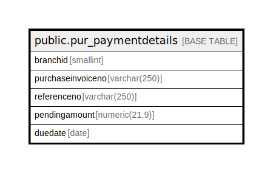

# public.pur_paymentdetails

## Description

## Columns

| Name | Type | Default | Nullable | Children | Parents | Comment |
| ---- | ---- | ------- | -------- | -------- | ------- | ------- |
| branchid | smallint |  | true |  |  |  |
| purchaseinvoiceno | varchar(250) |  | true |  |  |  |
| referenceno | varchar(250) |  | true |  |  |  |
| pendingamount | numeric(21,9) |  | true |  |  |  |
| duedate | date |  | true |  |  |  |

## Relations

---

> Generated by [tbls](https://github.com/k1LoW/tbls)
