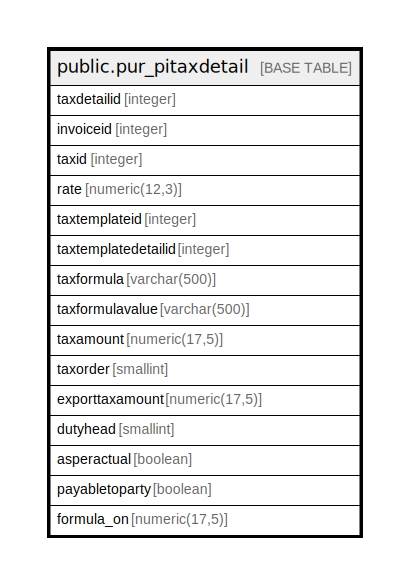

# public.pur_pitaxdetail

## Description

## Columns

| Name | Type | Default | Nullable | Children | Parents | Comment |
| ---- | ---- | ------- | -------- | -------- | ------- | ------- |
| taxdetailid | integer | nextval('pur_pitaxdetail_taxdetailid_seq'::regclass) | false |  |  |  |
| invoiceid | integer |  | true |  |  |  |
| taxid | integer |  | true |  |  |  |
| rate | numeric(12,3) | NULL::numeric | true |  |  |  |
| taxtemplateid | integer |  | true |  |  |  |
| taxtemplatedetailid | integer |  | true |  |  |  |
| taxformula | varchar(500) | NULL::character varying | true |  |  |  |
| taxformulavalue | varchar(500) | NULL::character varying | true |  |  |  |
| taxamount | numeric(17,5) | NULL::numeric | true |  |  |  |
| taxorder | smallint |  | true |  |  |  |
| exporttaxamount | numeric(17,5) | NULL::numeric | true |  |  |  |
| dutyhead | smallint |  | true |  |  |  |
| asperactual | boolean | false | true |  |  |  |
| payabletoparty | boolean | true | true |  |  |  |
| formula_on | numeric(17,5) |  | true |  |  |  |

## Constraints

| Name | Type | Definition |
| ---- | ---- | ---------- |
| pur_pitaxdetail_pkey | PRIMARY KEY | PRIMARY KEY (taxdetailid) |

## Indexes

| Name | Definition |
| ---- | ---------- |
| pur_pitaxdetail_pkey | CREATE UNIQUE INDEX pur_pitaxdetail_pkey ON public.pur_pitaxdetail USING btree (taxdetailid) |
| Index_PI_TaxDet_PIID | CREATE INDEX "Index_PI_TaxDet_PIID" ON public.pur_pitaxdetail USING btree (invoiceid) |

## Relations

---

> Generated by [tbls](https://github.com/k1LoW/tbls)
