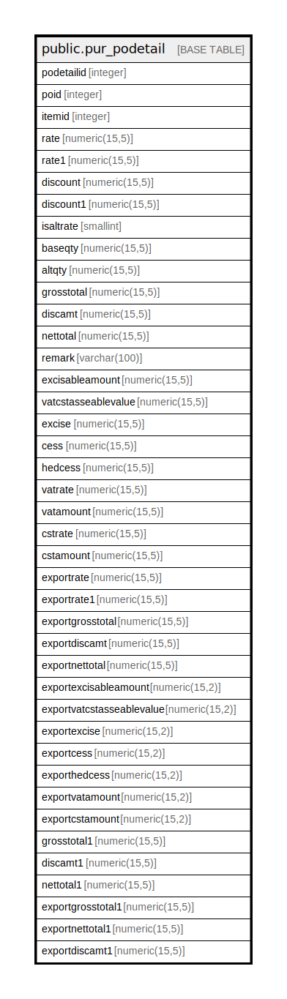

# public.pur_podetail

## Description

## Columns

| Name | Type | Default | Nullable | Children | Parents | Comment |
| ---- | ---- | ------- | -------- | -------- | ------- | ------- |
| podetailid | integer | nextval('pur_podetail_podetailid_seq'::regclass) | false |  |  |  |
| poid | integer |  | true |  |  |  |
| itemid | integer |  | true |  |  |  |
| rate | numeric(15,5) | 0 | true |  |  |  |
| rate1 | numeric(15,5) | 0 | true |  |  |  |
| discount | numeric(15,5) | 0 | true |  |  |  |
| discount1 | numeric(15,5) | 0 | true |  |  |  |
| isaltrate | smallint | 0 | true |  |  |  |
| baseqty | numeric(15,5) | 0 | true |  |  |  |
| altqty | numeric(15,5) | NULL::numeric | true |  |  |  |
| grosstotal | numeric(15,5) | 0 | true |  |  |  |
| discamt | numeric(15,5) | 0 | true |  |  |  |
| nettotal | numeric(15,5) | 0 | true |  |  |  |
| remark | varchar(100) |  | true |  |  |  |
| excisableamount | numeric(15,5) | 0 | true |  |  |  |
| vatcstasseablevalue | numeric(15,5) | 0 | true |  |  |  |
| excise | numeric(15,5) | 0 | true |  |  |  |
| cess | numeric(15,5) | 0 | true |  |  |  |
| hedcess | numeric(15,5) | 0 | true |  |  |  |
| vatrate | numeric(15,5) | 0 | true |  |  |  |
| vatamount | numeric(15,5) | 0 | true |  |  |  |
| cstrate | numeric(15,5) | 0 | true |  |  |  |
| cstamount | numeric(15,5) | 0 | true |  |  |  |
| exportrate | numeric(15,5) | 0 | true |  |  |  |
| exportrate1 | numeric(15,5) | 0 | true |  |  |  |
| exportgrosstotal | numeric(15,5) | 0 | true |  |  |  |
| exportdiscamt | numeric(15,5) | 0 | true |  |  |  |
| exportnettotal | numeric(15,5) | 0 | true |  |  |  |
| exportexcisableamount | numeric(15,2) | 0 | true |  |  |  |
| exportvatcstasseablevalue | numeric(15,2) | 0 | true |  |  |  |
| exportexcise | numeric(15,2) | 0 | true |  |  |  |
| exportcess | numeric(15,2) | 0 | true |  |  |  |
| exporthedcess | numeric(15,2) | 0 | true |  |  |  |
| exportvatamount | numeric(15,2) | 0 | true |  |  |  |
| exportcstamount | numeric(15,2) | 0 | true |  |  |  |
| grosstotal1 | numeric(15,5) |  | true |  |  |  |
| discamt1 | numeric(15,5) |  | true |  |  |  |
| nettotal1 | numeric(15,5) |  | true |  |  |  |
| exportgrosstotal1 | numeric(15,5) |  | true |  |  |  |
| exportnettotal1 | numeric(15,5) |  | true |  |  |  |
| exportdiscamt1 | numeric(15,5) |  | true |  |  |  |

## Constraints

| Name | Type | Definition |
| ---- | ---- | ---------- |
| pur_podetail_pkey | PRIMARY KEY | PRIMARY KEY (podetailid) |

## Indexes

| Name | Definition |
| ---- | ---------- |
| pur_podetail_pkey | CREATE UNIQUE INDEX pur_podetail_pkey ON public.pur_podetail USING btree (podetailid) |
| Index_PO_Det_POID | CREATE INDEX "Index_PO_Det_POID" ON public.pur_podetail USING btree (poid) |

## Relations

---

> Generated by [tbls](https://github.com/k1LoW/tbls)
