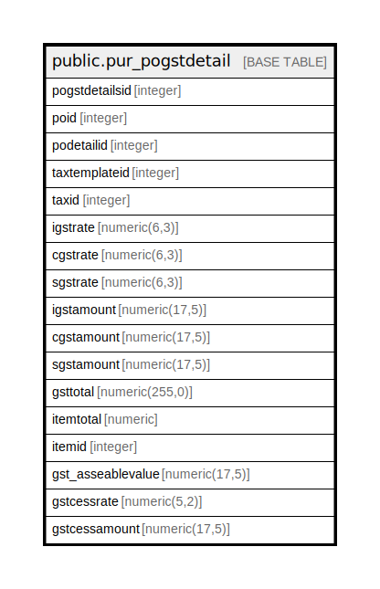

# public.pur_pogstdetail

## Description

## Columns

| Name | Type | Default | Nullable | Children | Parents | Comment |
| ---- | ---- | ------- | -------- | -------- | ------- | ------- |
| pogstdetailsid | integer | nextval('pur_pogstdetail_pogstdetailsid_seq'::regclass) | false |  |  |  |
| poid | integer |  | true |  |  |  |
| podetailid | integer |  | true |  |  |  |
| taxtemplateid | integer |  | true |  |  |  |
| taxid | integer |  | true |  |  |  |
| igstrate | numeric(6,3) |  | true |  |  |  |
| cgstrate | numeric(6,3) |  | true |  |  |  |
| sgstrate | numeric(6,3) |  | true |  |  |  |
| igstamount | numeric(17,5) | 0 | true |  |  |  |
| cgstamount | numeric(17,5) | 0 | true |  |  |  |
| sgstamount | numeric(17,5) | 0 | true |  |  |  |
| gsttotal | numeric(255,0) |  | true |  |  |  |
| itemtotal | numeric |  | true |  |  |  |
| itemid | integer |  | true |  |  |  |
| gst_asseablevalue | numeric(17,5) |  | true |  |  |  |
| gstcessrate | numeric(5,2) |  | true |  |  |  |
| gstcessamount | numeric(17,5) | 0 | true |  |  |  |

## Constraints

| Name | Type | Definition |
| ---- | ---- | ---------- |
| pur_pogstdetail_pkey | PRIMARY KEY | PRIMARY KEY (pogstdetailsid) |

## Indexes

| Name | Definition |
| ---- | ---------- |
| pur_pogstdetail_pkey | CREATE UNIQUE INDEX pur_pogstdetail_pkey ON public.pur_pogstdetail USING btree (pogstdetailsid) |
| Index_PO_GSTDet_POID | CREATE INDEX "Index_PO_GSTDet_POID" ON public.pur_pogstdetail USING btree (podetailid) |
| Index_PO_GSTDet_POIDDetID | CREATE INDEX "Index_PO_GSTDet_POIDDetID" ON public.pur_pogstdetail USING btree (poid, podetailid) |

## Relations

---

> Generated by [tbls](https://github.com/k1LoW/tbls)
