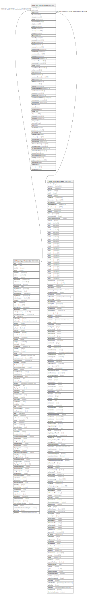

# public.pur_poitemdetail

## Description

## Columns

| Name | Type | Default | Nullable | Children | Parents | Comment |
| ---- | ---- | ------- | -------- | -------- | ------- | ------- |
| podetailid | integer | nextval('pur_poitemdetail_podetailid_seq'::regclass) | false |  |  |  |
| poid | integer |  | true |  | [public.pur_purchaseorder](public.pur_purchaseorder.md) |  |
| itemid | integer |  | true |  | [public.stor_itemmaster](public.stor_itemmaster.md) |  |
| rate | numeric(15,5) |  | true |  |  |  |
| discount | numeric(8,5) | 0 | true |  |  |  |
| baseqty | numeric(15,5) |  | true |  |  |  |
| requisitiondetailid | integer | 0 | true |  |  |  |
| altqty | numeric(15,5) |  | true |  |  |  |
| remark | varchar(500) | NULL::character varying | true |  |  |  |
| grosstotal | numeric(15,5) | 0 | true |  |  |  |
| discamt | numeric(15,5) | 0 | true |  |  |  |
| nettotal | numeric(15,5) | 0 | true |  |  |  |
| rate1 | numeric(15,5) | 0 | true |  |  |  |
| discount1 | numeric(15,5) | 0 | true |  |  |  |
| grosstotal1 | numeric(15,5) | 0 | true |  |  |  |
| discamt1 | numeric(15,5) | 0 | true |  |  |  |
| nettotal1 | numeric(15,5) | 0 | true |  |  |  |
| exportrate | numeric(15,5) | 0 | true |  |  |  |
| exportgrosstotal | numeric(15,5) | 0 | true |  |  |  |
| exportdiscamt | numeric(15,5) | 0 | true |  |  |  |
| exportnettotal | numeric(15,5) | 0 | true |  |  |  |
| exportrate1 | numeric(15,5) | 0 | true |  |  |  |
| exportgrosstotal1 | numeric(15,5) | 0 | true |  |  |  |
| exportdiscamt1 | numeric(15,5) | 0 | true |  |  |  |
| exportnettotal1 | numeric(15,5) | 0 | true |  |  |  |
| isaltrate | smallint |  | true |  |  |  |
| excisableamount | numeric(15,5) | 0 | true |  |  |  |
| excise | numeric(15,5) | 0 | true |  |  |  |
| cess | numeric(15,5) | 0 | true |  |  |  |
| hedcess | numeric(15,5) | 0 | true |  |  |  |
| vatcstasseablevalue | numeric(15,5) | 0 | true |  |  |  |
| vatrate | numeric(15,5) | 0 | true |  |  |  |
| vatamount | numeric(15,5) | 0 | true |  |  |  |
| cstrate | numeric(15,5) | 0 | true |  |  |  |
| cstamount | numeric(15,5) | 0 | true |  |  |  |
| exportexcisableamount | numeric(15,2) | 0 | true |  |  |  |
| exportexcise | numeric(15,2) | 0 | true |  |  |  |
| exportcess | numeric(15,2) | 0 | true |  |  |  |
| exporthedcess | numeric(15,2) | 0 | true |  |  |  |
| exportvatcstasseablevalue | numeric(15,2) | 0 | true |  |  |  |
| exportvatamount | numeric(15,2) | 0 | true |  |  |  |
| exportcstamount | numeric(15,2) | 0 | true |  |  |  |
| deactive | boolean | false | true |  |  |  |
| isclosed | boolean | false | true |  |  |  |
| itemspecification | text |  | true |  |  |  |
| duedate | date |  | true |  |  |  |
| adc | numeric(15,5) | 0 | true |  |  |  |
| discperunit | numeric(15,5) | 0 | true |  |  |  |
| potolerance | numeric(17,5) | 0.0 | true |  |  |  |
| priority | smallint | 3 | true |  |  | 1--Most Urgent 2--Urgent 3--General |
| customerid | integer |  | true |  |  |  |
| soid | integer |  | true |  |  |  |
| newaddeditem | boolean | true | true |  |  |  |
| porevisionno | varchar(30) |  | true |  |  |  |
| porevisiondate | date |  | true |  |  |  |
| porateeffectivefrom | date |  | true |  |  |  |
| excise_rate | numeric(17,5) | NULL::numeric | true |  |  | For Item Excise Ledger |
| excise_amount | numeric(17,5) | NULL::numeric | true |  |  | For Item Excise Ledger |
| additionalvatrate | numeric(21,9) | 0 | true |  |  |  |
| additionalvatamount | numeric(21,9) | 0 | true |  |  |  |
| surchargeonvatrate | numeric(21,9) | 0 | true |  |  |  |
| surchargeonvatamount | numeric(21,9) | 0 | true |  |  |  |
| gstasseablevalue | numeric(21,9) |  | true |  |  |  |
| hsnclassificationid | integer |  | true |  |  |  |
| isdiscountbyamount | boolean | false | true |  |  |  |
| poorderqty | numeric(20,5) |  | true |  |  |  |
| poqtyconversion | numeric(20,5) |  | true |  |  |  |
| pobomitemid | integer | 0 | true |  |  |  |
| unitformula | text | ''::text | true |  |  |  |
| stdrate | numeric(15,5) | 0 | true |  |  |  |
| isdiscperunit | boolean | false | true |  |  |  |

## Constraints

| Name | Type | Definition |
| ---- | ---- | ---------- |
| Const_PreventDuplicateItem | UNIQUE | UNIQUE (poid, itemid, remark, requisitiondetailid) |
| poitemdetail_pkey | PRIMARY KEY | PRIMARY KEY (podetailid) |
| poitemdetail_fk | FOREIGN KEY | FOREIGN KEY (poid) REFERENCES pur_purchaseorder(poid) ON UPDATE CASCADE |
| poitemdetail_fk1 | FOREIGN KEY | FOREIGN KEY (itemid) REFERENCES stor_itemmaster(itemid) ON UPDATE CASCADE |

## Indexes

| Name | Definition |
| ---- | ---------- |
| Const_PreventDuplicateItem | CREATE UNIQUE INDEX "Const_PreventDuplicateItem" ON public.pur_poitemdetail USING btree (poid, itemid, remark, requisitiondetailid) |
| poitemdetail_pkey | CREATE UNIQUE INDEX poitemdetail_pkey ON public.pur_poitemdetail USING btree (podetailid) |
| Index_PO_ItmDet_POID | CREATE INDEX "Index_PO_ItmDet_POID" ON public.pur_poitemdetail USING btree (poid) |

## Triggers

| Name | Definition |
| ---- | ---------- |
| func_update_pur_req_pending_qty | CREATE TRIGGER func_update_pur_req_pending_qty AFTER INSERT OR DELETE OR UPDATE ON public.pur_poitemdetail FOR EACH ROW EXECUTE FUNCTION tgr_func_update_pur_req_pending_qty() |

## Relations

---

> Generated by [tbls](https://github.com/k1LoW/tbls)
