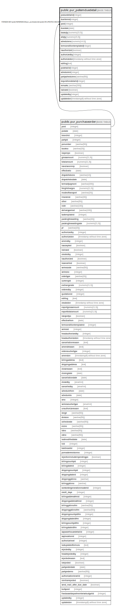

# public.pur_poitemduedetail

## Description

## Columns

| Name | Type | Default | Nullable | Children | Parents | Comment |
| ---- | ---- | ------- | -------- | -------- | ------- | ------- |
| poduedetailid | integer | nextval('pur_poitemduedetail_poduedetailid_seq'::regclass) | false |  |  |  |
| dueitemid | integer |  | true |  |  |  |
| poid | integer |  | true |  | [public.pur_purchaseorder](public.pur_purchaseorder.md) |  |
| duedate | date |  | true |  |  |  |
| baseqty | numeric(15,5) |  | true |  |  |  |
| altqty | numeric(15,5) |  | true |  |  |  |
| scheduleno | numeric(14,0) |  | true |  |  |  |
| termconditiontemplateid | integer |  | true |  |  |  |
| isauthorized | boolean | false | true |  |  |  |
| authorizedby | integer |  | true |  |  |  |
| authorizedon | timestamp without time zone |  | true |  |  |  |
| editlog | text |  | true |  |  |  |
| podetailid | integer |  | true |  |  |  |
| scheduleid | integer |  | true |  |  |  |
| partyscheduleno | varchar(50) |  | true |  |  |  |
| requisitiondetailid | integer |  | true |  |  |  |
| remarks | varchar(200) |  | true |  |  |  |
| isclosed | boolean | false | true |  |  |  |
| updatedby | integer |  | true |  |  |  |
| updatedon | timestamp(6) without time zone | NULL::timestamp without time zone | true |  |  |  |

## Constraints

| Name | Type | Definition |
| ---- | ---- | ---------- |
| poitemduedetail_pkey | PRIMARY KEY | PRIMARY KEY (poduedetailid) |
| poitemduedetail_fk | FOREIGN KEY | FOREIGN KEY (poid) REFERENCES pur_purchaseorder(poid) ON UPDATE CASCADE |

## Indexes

| Name | Definition |
| ---- | ---------- |
| poitemduedetail_pkey | CREATE UNIQUE INDEX poitemduedetail_pkey ON public.pur_poitemduedetail USING btree (poduedetailid) |
| Index_PO_ItmDet_DetID | CREATE INDEX "Index_PO_ItmDet_DetID" ON public.pur_poitemduedetail USING btree (podetailid) |
| Index_PO_ItmDet_POIDDetID | CREATE INDEX "Index_PO_ItmDet_POIDDetID" ON public.pur_poitemduedetail USING btree (poid, podetailid) |

## Triggers

| Name | Definition |
| ---- | ---------- |
| po_amend_log_entry | CREATE TRIGGER po_amend_log_entry BEFORE UPDATE ON public.pur_poitemduedetail FOR EACH ROW EXECUTE FUNCTION po_amend_log_entry() |

## Relations

---

> Generated by [tbls](https://github.com/k1LoW/tbls)
