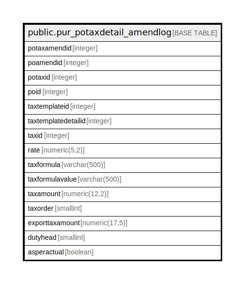

# public.pur_potaxdetail_amendlog

## Description

## Columns

| Name | Type | Default | Nullable | Children | Parents | Comment |
| ---- | ---- | ------- | -------- | -------- | ------- | ------- |
| potaxamendid | integer | nextval('pur_potaxdetail_amendlog_potaxamendid_seq'::regclass) | false |  |  |  |
| poamendid | integer |  | true |  |  |  |
| potaxid | integer |  | true |  |  |  |
| poid | integer |  | true |  |  |  |
| taxtemplateid | integer |  | true |  |  |  |
| taxtemplatedetailid | integer |  | true |  |  |  |
| taxid | integer |  | true |  |  |  |
| rate | numeric(5,2) |  | true |  |  |  |
| taxformula | varchar(500) |  | true |  |  |  |
| taxformulavalue | varchar(500) |  | true |  |  |  |
| taxamount | numeric(12,2) | 0 | true |  |  |  |
| taxorder | smallint |  | true |  |  |  |
| exporttaxamount | numeric(17,5) | NULL::numeric | true |  |  |  |
| dutyhead | smallint |  | true |  |  |  |
| asperactual | boolean |  | true |  |  |  |

## Constraints

| Name | Type | Definition |
| ---- | ---- | ---------- |
| pur_potaxdetail_amendlog_pkey | PRIMARY KEY | PRIMARY KEY (potaxamendid) |

## Indexes

| Name | Definition |
| ---- | ---------- |
| pur_potaxdetail_amendlog_pkey | CREATE UNIQUE INDEX pur_potaxdetail_amendlog_pkey ON public.pur_potaxdetail_amendlog USING btree (potaxamendid) |

## Relations

---

> Generated by [tbls](https://github.com/k1LoW/tbls)
