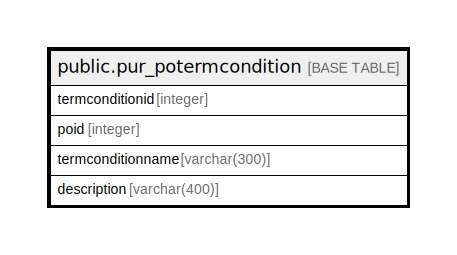

# public.pur_potermcondition

## Description

## Columns

| Name | Type | Default | Nullable | Children | Parents | Comment |
| ---- | ---- | ------- | -------- | -------- | ------- | ------- |
| termconditionid | integer | nextval('pur_potermcondition_termconditionid_seq'::regclass) | false |  |  |  |
| poid | integer |  | true |  |  |  |
| termconditionname | varchar(300) |  | true |  |  |  |
| description | varchar(400) |  | true |  |  |  |

## Constraints

| Name | Type | Definition |
| ---- | ---- | ---------- |
| pur_potermcondition_pkey | PRIMARY KEY | PRIMARY KEY (termconditionid) |

## Indexes

| Name | Definition |
| ---- | ---------- |
| pur_potermcondition_pkey | CREATE UNIQUE INDEX pur_potermcondition_pkey ON public.pur_potermcondition USING btree (termconditionid) |

## Relations

---

> Generated by [tbls](https://github.com/k1LoW/tbls)
