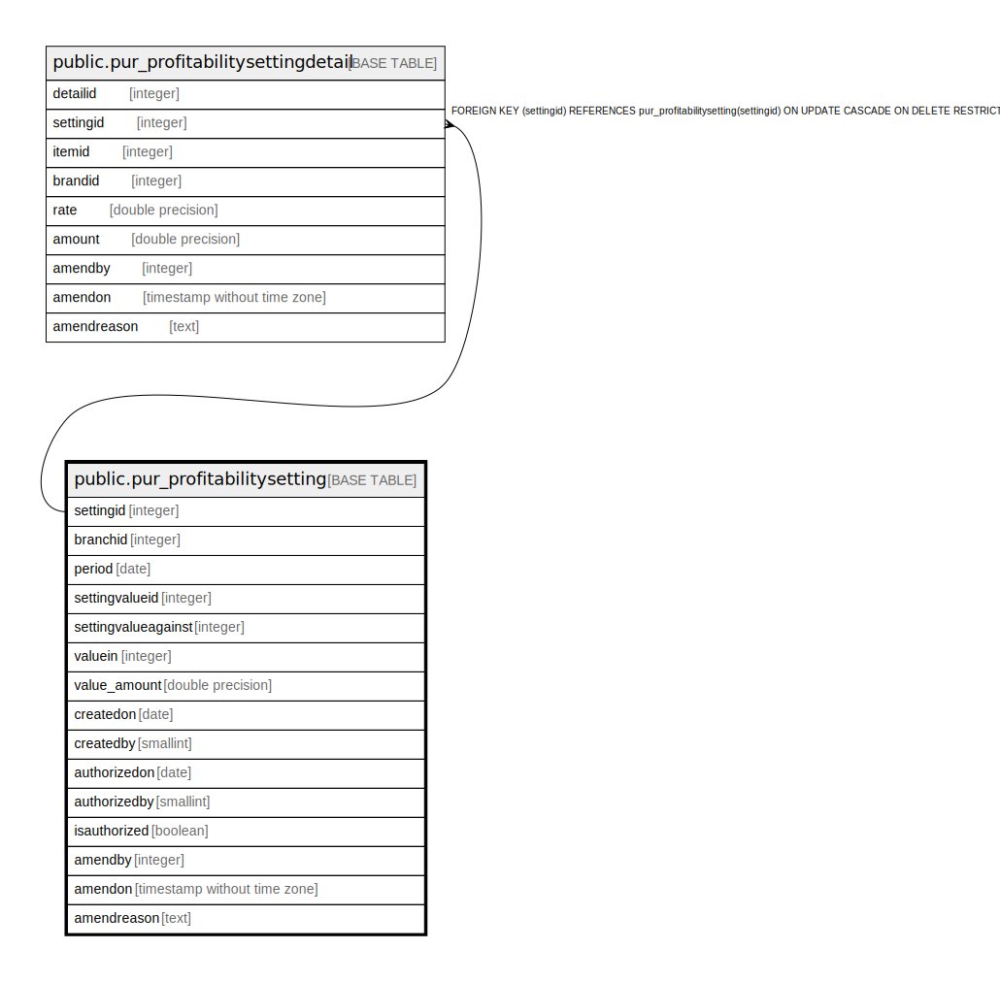

# public.pur_profitabilitysetting

## Description

## Columns

| Name | Type | Default | Nullable | Children | Parents | Comment |
| ---- | ---- | ------- | -------- | -------- | ------- | ------- |
| settingid | integer | nextval('pur_profitabilitysetting_settingid_seq'::regclass) | false | [public.pur_profitabilitysettingdetail](public.pur_profitabilitysettingdetail.md) |  |  |
| branchid | integer |  | true |  |  |  |
| period | date |  | true |  |  |  |
| settingvalueid | integer |  | true |  |  |  |
| settingvalueagainst | integer |  | true |  |  | 0 -> None 1 -> Brand 2 -> Item |
| valuein | integer |  | true |  |  | 0 -> Rate 1 -> Amount |
| value_amount | double precision |  | true |  |  |  |
| createdon | date |  | true |  |  |  |
| createdby | smallint |  | true |  |  |  |
| authorizedon | date |  | true |  |  |  |
| authorizedby | smallint |  | true |  |  |  |
| isauthorized | boolean |  | true |  |  |  |
| amendby | integer |  | true |  |  |  |
| amendon | timestamp without time zone |  | true |  |  |  |
| amendreason | text |  | true |  |  |  |

## Constraints

| Name | Type | Definition |
| ---- | ---- | ---------- |
| pur_profitabilitysetting_pkey | PRIMARY KEY | PRIMARY KEY (settingid) |

## Indexes

| Name | Definition |
| ---- | ---------- |
| pur_profitabilitysetting_pkey | CREATE UNIQUE INDEX pur_profitabilitysetting_pkey ON public.pur_profitabilitysetting USING btree (settingid) |

## Triggers

| Name | Definition |
| ---- | ---------- |
| settingmaster_amend_log_entry | CREATE TRIGGER settingmaster_amend_log_entry BEFORE UPDATE ON public.pur_profitabilitysetting FOR EACH ROW EXECUTE FUNCTION profitability_amend_log_entry() |

## Relations

---

> Generated by [tbls](https://github.com/k1LoW/tbls)
