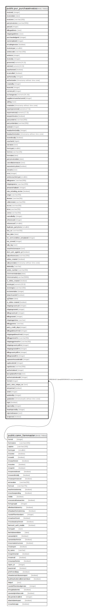

# public.pur_purchaseinvoice

## Description

## Columns

| Name | Type | Default | Nullable | Children | Parents | Comment |
| ---- | ---- | ------- | -------- | -------- | ------- | ------- |
| invoiceid | integer | nextval('pur_purchaseinvoice_invoiceid_seq'::regclass) | false |  |  |  |
| invoicedate | date |  | true |  |  |  |
| invoiceno | varchar(100) |  | true |  |  |  |
| partyinvoiceno | varchar(500) |  | true |  |  |  |
| partyid | integer |  | true |  |  |  |
| billingaddress | text |  | true |  |  |  |
| shippingaddress | text |  | true |  |  |  |
| purchaseledgerid | integer |  | true |  |  |  |
| taxtemplateid | integer |  | true |  |  |  |
| istradinginvoice | boolean | false | true |  |  |  |
| invoicetype | smallint | 0 | true |  |  | Purchase invoice -->0, Fixed Asset Purchase Invoice -->1,  Credit Note (CN) -->2,  JobWork -->3, Service PI -->4, CreditNote [Only View][Create Automaticaly] (Inward Challan and PO Rate Difference) -->5,  DebitNote[Only View][Create Automaticaly] (Inward Challan and PO Rate Difference) -->6, Supplimentary Purchase Invoice (SUPPI) -->7 CreditNote Against SalesInvoice ->8,  CreditNote Manualy ->9,  Credit Note Against Inward Challan -->10,  Trading Excise Opening (TEO) -->11 , Purchase Invoice Against Service (ServPI) -->12 |
| seriescode | varchar(100) |  | true |  |  |  |
| seriesno | integer |  | true |  |  |  |
| invoiceby | integer |  | true |  |  |  |
| grosstotal | numeric(14,2) |  | true |  |  |  |
| nettotal | numeric(14,2) |  | true |  |  |  |
| isauthorized | boolean | false | true |  |  |  |
| iscancelled | boolean | false | true |  |  |  |
| authorizedby | integer |  | true |  |  |  |
| authorizedon | timestamp without time zone |  | true |  |  |  |
| createdby | integer |  | true |  |  |  |
| branchid | integer |  | true |  |  |  |
| currencyid | integer |  | true |  |  |  |
| exchangerate | numeric(20,10) | NULL::numeric | true |  |  |  |
| supplierormanufacturerid | integer |  | true |  |  |  |
| editlog | text |  | true |  |  |  |
| createdon | timestamp without time zone | now() | true |  |  |  |
| exportgrosstotal | numeric(17,5) | NULL::numeric | true |  |  |  |
| exportnettotal | numeric(17,5) | NULL::numeric | true |  |  |  |
| isexportinvoice | boolean | false | true |  |  |  |
| partyorderno | varchar(200) | NULL::character varying | true |  |  |  |
| partyorderdate | varchar(200) | NULL::character varying | true |  |  |  |
| seriesid | integer |  | true |  |  |  |
| headauthorizedby | integer |  | true |  |  |  |
| headauthorizedon | timestamp without time zone |  | true |  |  |  |
| issendtotally | boolean | false | true |  |  |  |
| voucherid | bigint |  | true |  |  |  |
| narration | text | ''::character varying | true |  |  |  |
| formtype | smallint |  | true |  |  |  |
| formno | varchar(20) | NULL::character varying | true |  |  |  |
| formdate | date |  | true |  |  |  |
| partyinvoicedate | date |  | true |  |  |  |
| cancellationreason | text |  | true |  |  |  |
| isassetentrydone | boolean | false | true |  |  |  |
| remarks | text |  | true |  |  |  |
| srno | integer |  | true |  |  |  |
| seriesvouchertype | smallint | 0 | true |  |  |  |
| billingname | varchar(200) |  | true |  |  |  |
| shippingname | varchar(200) |  | true |  |  |  |
| pinwardchallanid | integer |  | true |  |  |  |
| rate_including_excise | boolean | false | true |  |  |  |
| range | varchar(50) |  | true |  |  |  |
| division | varchar(50) |  | true |  |  |  |
| collectorate | varchar(50) |  | true |  |  |  |
| eccno | varchar(50) |  | true |  |  |  |
| lstno | varchar(50) |  | true |  |  |  |
| cstno | varchar(50) |  | true |  |  |  |
| cancelledby | integer |  | true |  |  |  |
| referenceid | integer |  | true |  |  |  |
| referenceof | smallint |  | true |  |  | 0->Purchase Invoice 1->Inward Challan 2->Sales Invoice |
| duplicate_partyinvno | smallint | 0 | false |  |  |  |
| boe_no | varchar(50) |  | true |  |  |  |
| boe_date | date |  | true |  |  |  |
| inv_termcondition_templateid | integer | 0 | true |  |  |  |
| teo_storeid | integer |  | true |  |  |  |
| tally_log | text | ''::text | true |  |  |  |
| unauthorizereason | text |  | true |  |  |  |
| dncn_amt_against_pi | boolean | false | true |  |  |  |
| tallyreferenceno | varchar(200) |  | true |  |  |  |
| online_created | boolean | false | true |  |  |  |
| tallysyncdate | timestamp without time zone |  | true |  |  |  |
| deletedby | varchar |  | true |  |  |  |
| series_number | varchar(50) |  | true |  |  |  |
| cformreminderdate | date |  | true |  |  |  |
| cformremarks | varchar(5000) |  | true |  |  |  |
| is_online_created | boolean | true | true |  |  | flag created on 4 june 2014 |
| storetype | numeric(18,0) |  | true |  |  |  |
| storeregno | varchar(100) |  | true |  |  |  |
| exciseserialno | integer |  | true |  |  |  |
| isbatchcardref | boolean | false | true |  |  |  |
| rg23date | date |  | true |  |  |  |
| is_online created | boolean | true | true |  |  |  |
| shippingcountryid | integer |  | true |  |  |  |
| shippingstateid | integer |  | true |  |  |  |
| billingcountryid | integer |  | true |  |  |  |
| billingstateid | integer |  | true |  |  |  |
| shippinggstinno | varchar |  | true |  |  |  |
| billinggstinno | varchar |  | true |  |  |  |
| party_credit_days | integer |  | true |  |  |  |
| billingaddressfrmid | integer |  | true |  |  |  |
| shippingaddressfrmid | integer |  | true |  |  |  |
| billinggstinnofrm | varchar(50) |  | true |  |  |  |
| shippinggstinnofrm | varchar(50) |  | true |  |  |  |
| shippingcountryidfrm | integer |  | true |  |  |  |
| shippingstateidfrm | integer |  | true |  |  |  |
| billingcountryidfrm | integer |  | true |  |  |  |
| billingstateidfrm | integer |  | true |  |  |  |
| sapwarehousedetailid | integer | 0 | false |  |  |  |
| saplocationid | integer | 0 | false |  |  |  |
| saptdsrate | varchar(250) | ''::character varying | false |  |  |  |
| authorizelevel | integer | 0 | true |  |  |  |
| lastupdatedformula | text |  | true |  |  |  |
| authorizationlevelid | integer | 0 | true |  |  |  |
| formid | integer | 77 | false |  | [public.comn_formmaster](public.comn_formmaster.md) |  |
| party_wise_unique_no | text |  | true |  |  |  |
| isimported | boolean | false | true |  |  |  |
| siteid | integer |  | true |  |  |  |
| updatedby | integer |  | true |  |  |  |
| updatedon | timestamp(6) without time zone | now() | true |  |  |  |
| isgst | boolean | false | true |  |  |  |
| rejectedby | integer |  | true |  |  |  |
| headrejectedby | integer |  | true |  |  |  |
| rejectedreason | text |  | true |  |  |  |
| isrejected | boolean | false | true |  |  |  |

## Constraints

| Name | Type | Definition |
| ---- | ---- | ---------- |
| pur_purchaseinvoice_formid_fkey | FOREIGN KEY | FOREIGN KEY (formid) REFERENCES comn_formmaster(formid) |
| pur_purchaseinvoice_pkey | PRIMARY KEY | PRIMARY KEY (invoiceid) |

## Indexes

| Name | Definition |
| ---- | ---------- |
| pur_purchaseinvoice_pkey | CREATE UNIQUE INDEX pur_purchaseinvoice_pkey ON public.pur_purchaseinvoice USING btree (invoiceid) |
| Index_PU_Sum_PartyID | CREATE INDEX "Index_PU_Sum_PartyID" ON public.pur_purchaseinvoice USING btree (partyid) |
| Index_PurInv_InvDateBrn | CREATE INDEX "Index_PurInv_InvDateBrn" ON public.pur_purchaseinvoice USING btree (invoicedate, branchid) |
| Index_PurInv_InvIdCan | CREATE INDEX "Index_PurInv_InvIdCan" ON public.pur_purchaseinvoice USING btree (invoiceid) WHERE ((invoicetype = ANY (ARRAY[0, 1])) AND (iscancelled = false) AND (istradinginvoice = false)) |
| ui_purchaseinvoice_invoiceno | CREATE UNIQUE INDEX ui_purchaseinvoice_invoiceno ON public.pur_purchaseinvoice USING btree (branchid, invoicetype, invoicedate, invoiceno) WHERE (invoiceid > 74582) |

## Triggers

| Name | Definition |
| ---- | ---------- |
| exciseserialno | CREATE TRIGGER exciseserialno AFTER INSERT ON public.pur_purchaseinvoice FOR EACH ROW EXECUTE FUNCTION trg_generate_exciseserialno() |
| prevent_deletion | CREATE TRIGGER prevent_deletion BEFORE DELETE ON public.pur_purchaseinvoice FOR EACH ROW EXECUTE FUNCTION prevent_deletion() |
| tgr_gstr_validate | CREATE TRIGGER tgr_gstr_validate AFTER INSERT OR DELETE OR UPDATE ON public.pur_purchaseinvoice FOR EACH ROW EXECUTE FUNCTION fun_tgr_gstr_validate() |
| tgr_tpi_auto_insert_rg23dno | CREATE TRIGGER tgr_tpi_auto_insert_rg23dno AFTER UPDATE ON public.pur_purchaseinvoice FOR EACH ROW EXECUTE FUNCTION tgr_tpi_auto_insert_rg23dno() |

## Relations

---

> Generated by [tbls](https://github.com/k1LoW/tbls)
