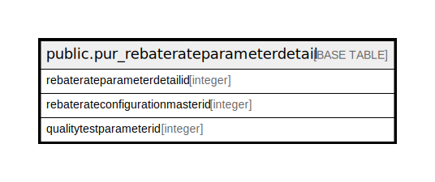

# public.pur_rebaterateparameterdetail

## Description

## Columns

| Name | Type | Default | Nullable | Children | Parents | Comment |
| ---- | ---- | ------- | -------- | -------- | ------- | ------- |
| rebaterateparameterdetailid | integer | nextval('pur_rebaterateparameterdetail_rebaterateparameterdetailid_seq'::regclass) | false |  |  |  |
| rebaterateconfigurationmasterid | integer |  | true |  |  |  |
| qualitytestparameterid | integer |  | true |  |  |  |

## Constraints

| Name | Type | Definition |
| ---- | ---- | ---------- |
| pur_rebaterateparameterdetail_pkey | PRIMARY KEY | PRIMARY KEY (rebaterateparameterdetailid) |

## Indexes

| Name | Definition |
| ---- | ---------- |
| pur_rebaterateparameterdetail_pkey | CREATE UNIQUE INDEX pur_rebaterateparameterdetail_pkey ON public.pur_rebaterateparameterdetail USING btree (rebaterateparameterdetailid) |

## Relations

---

> Generated by [tbls](https://github.com/k1LoW/tbls)
