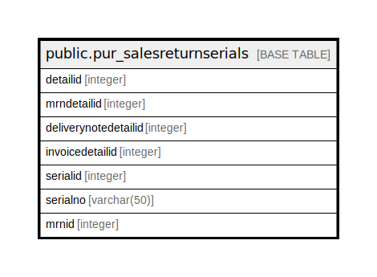

# public.pur_salesreturnserials

## Description

## Columns

| Name | Type | Default | Nullable | Children | Parents | Comment |
| ---- | ---- | ------- | -------- | -------- | ------- | ------- |
| detailid | integer | nextval('pur_salesreturnserials_detailid_seq'::regclass) | false |  |  |  |
| mrndetailid | integer |  | true |  |  |  |
| deliverynotedetailid | integer |  | true |  |  |  |
| invoicedetailid | integer |  | true |  |  |  |
| serialid | integer |  | true |  |  |  |
| serialno | varchar(50) |  | true |  |  |  |
| mrnid | integer |  | true |  |  |  |

## Constraints

| Name | Type | Definition |
| ---- | ---- | ---------- |
| pur_salesreturnserials_pkey | PRIMARY KEY | PRIMARY KEY (detailid) |

## Indexes

| Name | Definition |
| ---- | ---------- |
| pur_salesreturnserials_pkey | CREATE UNIQUE INDEX pur_salesreturnserials_pkey ON public.pur_salesreturnserials USING btree (detailid) |

## Relations

---

> Generated by [tbls](https://github.com/k1LoW/tbls)
