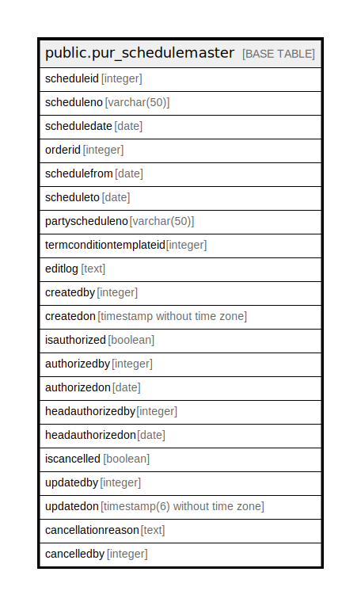

# public.pur_schedulemaster

## Description

## Columns

| Name | Type | Default | Nullable | Children | Parents | Comment |
| ---- | ---- | ------- | -------- | -------- | ------- | ------- |
| scheduleid | integer | nextval('pur_schedulemaster_scheduleid_seq'::regclass) | false |  |  |  |
| scheduleno | varchar(50) | NULL::character varying | true |  |  |  |
| scheduledate | date |  | true |  |  |  |
| orderid | integer |  | true |  |  |  |
| schedulefrom | date |  | true |  |  |  |
| scheduleto | date |  | true |  |  |  |
| partyscheduleno | varchar(50) | NULL::character varying | true |  |  |  |
| termconditiontemplateid | integer |  | true |  |  |  |
| editlog | text |  | true |  |  |  |
| createdby | integer |  | true |  |  |  |
| createdon | timestamp without time zone | now() | true |  |  |  |
| isauthorized | boolean | false | true |  |  |  |
| authorizedby | integer |  | true |  |  |  |
| authorizedon | date |  | true |  |  |  |
| headauthorizedby | integer |  | true |  |  |  |
| headauthorizedon | date |  | true |  |  |  |
| iscancelled | boolean | false | true |  |  |  |
| updatedby | integer |  | true |  |  |  |
| updatedon | timestamp(6) without time zone | NULL::timestamp without time zone | true |  |  |  |
| cancellationreason | text |  | true |  |  |  |
| cancelledby | integer | 0 | true |  |  |  |

## Constraints

| Name | Type | Definition |
| ---- | ---- | ---------- |
| pur_schedulemaster_pkey | PRIMARY KEY | PRIMARY KEY (scheduleid) |

## Indexes

| Name | Definition |
| ---- | ---------- |
| pur_schedulemaster_pkey | CREATE UNIQUE INDEX pur_schedulemaster_pkey ON public.pur_schedulemaster USING btree (scheduleid) |

## Relations

---

> Generated by [tbls](https://github.com/k1LoW/tbls)
