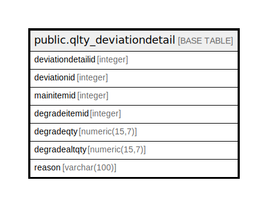

# public.qlty_deviationdetail

## Description

## Columns

| Name | Type | Default | Nullable | Children | Parents | Comment |
| ---- | ---- | ------- | -------- | -------- | ------- | ------- |
| deviationdetailid | integer | nextval('qlty_deviationdetail_deviationdetailid_seq'::regclass) | false |  |  |  |
| deviationid | integer |  | true |  |  |  |
| mainitemid | integer |  | true |  |  |  |
| degradeitemid | integer |  | true |  |  |  |
| degradeqty | numeric(15,7) |  | true |  |  |  |
| degradealtqty | numeric(15,7) |  | true |  |  |  |
| reason | varchar(100) |  | true |  |  |  |

## Constraints

| Name | Type | Definition |
| ---- | ---- | ---------- |
| qlty_deviationdetail_pkey | PRIMARY KEY | PRIMARY KEY (deviationdetailid) |

## Indexes

| Name | Definition |
| ---- | ---------- |
| qlty_deviationdetail_pkey | CREATE UNIQUE INDEX qlty_deviationdetail_pkey ON public.qlty_deviationdetail USING btree (deviationdetailid) |

## Relations

---

> Generated by [tbls](https://github.com/k1LoW/tbls)
