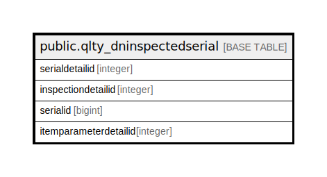

# public.qlty_dninspectedserial

## Description

## Columns

| Name | Type | Default | Nullable | Children | Parents | Comment |
| ---- | ---- | ------- | -------- | -------- | ------- | ------- |
| serialdetailid | integer | nextval('qlty_dninspectedserial_serialdetailid_seq'::regclass) | false |  |  |  |
| inspectiondetailid | integer |  | true |  |  |  |
| serialid | bigint |  | true |  |  |  |
| itemparameterdetailid | integer |  | true |  |  |  |

## Constraints

| Name | Type | Definition |
| ---- | ---- | ---------- |
| qlty_dninspectedserial_pkey | PRIMARY KEY | PRIMARY KEY (serialdetailid) |

## Indexes

| Name | Definition |
| ---- | ---------- |
| qlty_dninspectedserial_pkey | CREATE UNIQUE INDEX qlty_dninspectedserial_pkey ON public.qlty_dninspectedserial USING btree (serialdetailid) |

## Relations

---

> Generated by [tbls](https://github.com/k1LoW/tbls)
