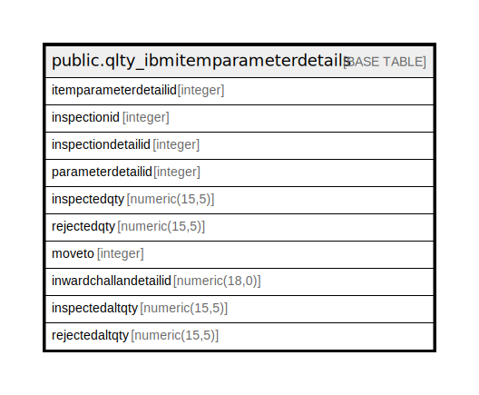

# public.qlty_ibmitemparameterdetails

## Description

## Columns

| Name | Type | Default | Nullable | Children | Parents | Comment |
| ---- | ---- | ------- | -------- | -------- | ------- | ------- |
| itemparameterdetailid | integer | nextval('qlty_ibmitemparameterdetails_itemparameterdetailid_seq'::regclass) | false |  |  |  |
| inspectionid | integer |  | true |  |  |  |
| inspectiondetailid | integer |  | true |  |  |  |
| parameterdetailid | integer |  | true |  |  |  |
| inspectedqty | numeric(15,5) |  | true |  |  |  |
| rejectedqty | numeric(15,5) |  | true |  |  |  |
| moveto | integer |  | true |  |  |  |
| inwardchallandetailid | numeric(18,0) |  | true |  |  |  |
| inspectedaltqty | numeric(15,5) |  | true |  |  |  |
| rejectedaltqty | numeric(15,5) |  | true |  |  |  |

## Constraints

| Name | Type | Definition |
| ---- | ---- | ---------- |
| qlty_ibmitemparameterdetails_pkey | PRIMARY KEY | PRIMARY KEY (itemparameterdetailid) |

## Indexes

| Name | Definition |
| ---- | ---------- |
| qlty_ibmitemparameterdetails_pkey | CREATE UNIQUE INDEX qlty_ibmitemparameterdetails_pkey ON public.qlty_ibmitemparameterdetails USING btree (itemparameterdetailid) |

## Relations

---

> Generated by [tbls](https://github.com/k1LoW/tbls)
