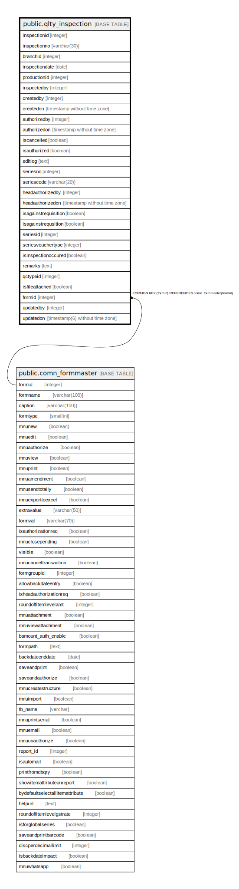

# public.qlty_inspection

## Description

## Columns

| Name | Type | Default | Nullable | Children | Parents | Comment |
| ---- | ---- | ------- | -------- | -------- | ------- | ------- |
| inspectionid | integer | nextval('qlty_inspection_inspectionid_seq'::regclass) | false |  |  |  |
| inspectionno | varchar(30) |  | true |  |  |  |
| branchid | integer |  | true |  |  |  |
| inspectiondate | date |  | true |  |  |  |
| productionid | integer |  | true |  |  |  |
| inspectedby | integer |  | true |  |  |  |
| createdby | integer |  | true |  |  |  |
| createdon | timestamp without time zone | now() | true |  |  |  |
| authorizedby | integer |  | true |  |  |  |
| authorizedon | timestamp without time zone | now() | true |  |  |  |
| iscancelled | boolean | false | true |  |  |  |
| isauthorized | boolean | false | true |  |  |  |
| editlog | text |  | true |  |  |  |
| seriesno | integer |  | true |  |  |  |
| seriescode | varchar(20) |  | true |  |  |  |
| headauthorizedby | integer |  | true |  |  |  |
| headauthorizedon | timestamp without time zone |  | true |  |  |  |
| isagainstrequisition | boolean | false | true |  |  |  |
| isagainstrequsition | boolean | false | true |  |  |  |
| seriesid | integer |  | true |  |  |  |
| seriesvouchertype | integer |  | true |  |  |  |
| isinspectionoccured | boolean | false | true |  |  |  |
| remarks | text |  | true |  |  |  |
| qctypeid | integer | 0 | true |  |  |  |
| isfileattached | boolean | false | true |  |  |  |
| formid | integer | 626 | false |  | [public.comn_formmaster](public.comn_formmaster.md) |  |
| updatedby | integer |  | true |  |  |  |
| updatedon | timestamp(6) without time zone | NULL::timestamp without time zone | true |  |  |  |

## Constraints

| Name | Type | Definition |
| ---- | ---- | ---------- |
| qlty_inspection_formid_fkey | FOREIGN KEY | FOREIGN KEY (formid) REFERENCES comn_formmaster(formid) |
| qlty_inspection_pkey | PRIMARY KEY | PRIMARY KEY (inspectionid) |

## Indexes

| Name | Definition |
| ---- | ---------- |
| qlty_inspection_pkey | CREATE UNIQUE INDEX qlty_inspection_pkey ON public.qlty_inspection USING btree (inspectionid) |
| ui_qltyinsp_no | CREATE UNIQUE INDEX ui_qltyinsp_no ON public.qlty_inspection USING btree (inspectionno, inspectiondate, branchid, seriesid, seriesvouchertype) WHERE (inspectionid > 2) |

## Triggers

| Name | Definition |
| ---- | ---------- |
| trg_updateinspectqtyinproduction | CREATE TRIGGER trg_updateinspectqtyinproduction AFTER UPDATE ON public.qlty_inspection FOR EACH ROW EXECUTE FUNCTION trg_updateinspectqtyinproduction() |

## Relations

---

> Generated by [tbls](https://github.com/k1LoW/tbls)
