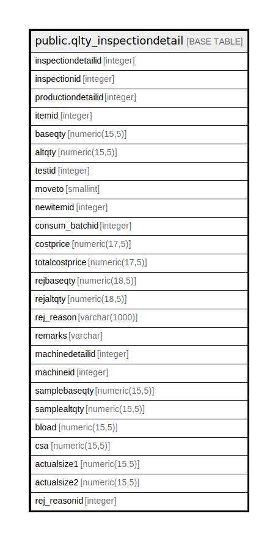

# public.qlty_inspectiondetail

## Description

## Columns

| Name | Type | Default | Nullable | Children | Parents | Comment |
| ---- | ---- | ------- | -------- | -------- | ------- | ------- |
| inspectiondetailid | integer | nextval('qlty_inspectiondetail_inspectiondetailid_seq'::regclass) | false |  |  |  |
| inspectionid | integer |  | true |  |  |  |
| productiondetailid | integer |  | true |  |  |  |
| itemid | integer |  | true |  |  |  |
| baseqty | numeric(15,5) |  | true |  |  |  |
| altqty | numeric(15,5) |  | true |  |  |  |
| testid | integer |  | true |  |  |  |
| moveto | smallint |  | true |  |  | 1-rework 2-rejection 3-nextstageorstore |
| newitemid | integer |  | true |  |  |  |
| consum_batchid | integer |  | true |  |  |  |
| costprice | numeric(17,5) | 0 | true |  |  |  |
| totalcostprice | numeric(17,5) | 0 | true |  |  |  |
| rejbaseqty | numeric(18,5) |  | true |  |  |  |
| rejaltqty | numeric(18,5) |  | true |  |  |  |
| rej_reason | varchar(1000) |  | true |  |  |  |
| remarks | varchar |  | true |  |  |  |
| machinedetailid | integer |  | true |  |  |  |
| machineid | integer |  | true |  |  |  |
| samplebaseqty | numeric(15,5) |  | true |  |  |  |
| samplealtqty | numeric(15,5) |  | true |  |  |  |
| bload | numeric(15,5) |  | true |  |  |  |
| csa | numeric(15,5) |  | true |  |  |  |
| actualsize1 | numeric(15,5) |  | true |  |  |  |
| actualsize2 | numeric(15,5) |  | true |  |  |  |
| rej_reasonid | integer |  | true |  |  |  |

## Constraints

| Name | Type | Definition |
| ---- | ---- | ---------- |
| qlty_inspectiondetail_pkey | PRIMARY KEY | PRIMARY KEY (inspectiondetailid) |

## Indexes

| Name | Definition |
| ---- | ---------- |
| qlty_inspectiondetail_pkey | CREATE UNIQUE INDEX qlty_inspectiondetail_pkey ON public.qlty_inspectiondetail USING btree (inspectiondetailid) |

## Relations

---

> Generated by [tbls](https://github.com/k1LoW/tbls)
