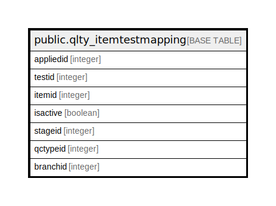

# public.qlty_itemtestmapping

## Description

## Columns

| Name | Type | Default | Nullable | Children | Parents | Comment |
| ---- | ---- | ------- | -------- | -------- | ------- | ------- |
| appliedid | integer | nextval('qlty_itemtestmapping_appliedid_seq'::regclass) | false |  |  |  |
| testid | integer |  | true |  |  |  |
| itemid | integer |  | true |  |  |  |
| isactive | boolean | true | true |  |  |  |
| stageid | integer |  | true |  |  |  |
| qctypeid | integer | 0 | true |  |  |  |
| branchid | integer | 0 | true |  |  |  |

## Constraints

| Name | Type | Definition |
| ---- | ---- | ---------- |
| qlty_itemtestmapping_pkey | PRIMARY KEY | PRIMARY KEY (appliedid) |

## Indexes

| Name | Definition |
| ---- | ---------- |
| qlty_itemtestmapping_pkey | CREATE UNIQUE INDEX qlty_itemtestmapping_pkey ON public.qlty_itemtestmapping USING btree (appliedid) |

## Relations

---

> Generated by [tbls](https://github.com/k1LoW/tbls)
