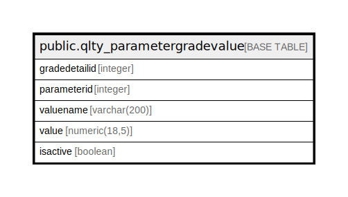

# public.qlty_parametergradevalue

## Description

## Columns

| Name | Type | Default | Nullable | Children | Parents | Comment |
| ---- | ---- | ------- | -------- | -------- | ------- | ------- |
| gradedetailid | integer | nextval('qlty_parametergradevalue_gradedetailid_seq'::regclass) | false |  |  |  |
| parameterid | integer |  | true |  |  |  |
| valuename | varchar(200) |  | true |  |  |  |
| value | numeric(18,5) |  | true |  |  |  |
| isactive | boolean | false | true |  |  |  |

## Constraints

| Name | Type | Definition |
| ---- | ---- | ---------- |
| qlty_parametergradevalue_pkey | PRIMARY KEY | PRIMARY KEY (gradedetailid) |

## Indexes

| Name | Definition |
| ---- | ---------- |
| qlty_parametergradevalue_pkey | CREATE UNIQUE INDEX qlty_parametergradevalue_pkey ON public.qlty_parametergradevalue USING btree (gradedetailid) |

## Relations

---

> Generated by [tbls](https://github.com/k1LoW/tbls)
