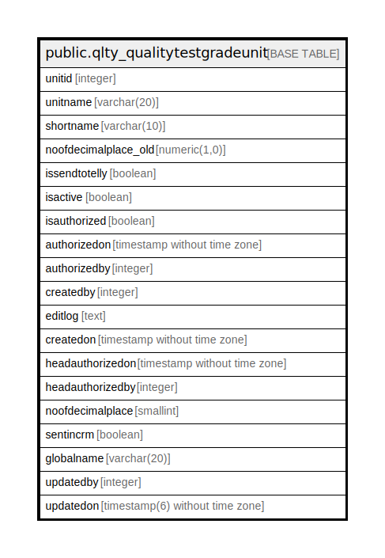

# public.qlty_qualitytestgradeunit

## Description

## Columns

| Name | Type | Default | Nullable | Children | Parents | Comment |
| ---- | ---- | ------- | -------- | -------- | ------- | ------- |
| unitid | integer | nextval('qlty_qualitytestgradeunit_unitid_seq'::regclass) | false |  |  |  |
| unitname | varchar(20) |  | true |  |  |  |
| shortname | varchar(10) |  | true |  |  |  |
| noofdecimalplace_old | numeric(1,0) |  | true |  |  |  |
| issendtotelly | boolean | false | true |  |  |  |
| isactive | boolean | true | false |  |  |  |
| isauthorized | boolean | false | false |  |  |  |
| authorizedon | timestamp without time zone |  | true |  |  |  |
| authorizedby | integer |  | true |  |  |  |
| createdby | integer |  | true |  |  |  |
| editlog | text |  | true |  |  |  |
| createdon | timestamp without time zone | now() | true |  |  |  |
| headauthorizedon | timestamp without time zone |  | true |  |  |  |
| headauthorizedby | integer |  | true |  |  |  |
| noofdecimalplace | smallint | 0 | true |  |  |  |
| sentincrm | boolean | false | true |  |  |  |
| globalname | varchar(20) | ''::character varying | true |  |  |  |
| updatedby | integer |  | true |  |  |  |
| updatedon | timestamp(6) without time zone | NULL::timestamp without time zone | true |  |  |  |

## Constraints

| Name | Type | Definition |
| ---- | ---- | ---------- |
| qualitytestgradeunit_pkey | PRIMARY KEY | PRIMARY KEY (unitid) |
| qualitytestgradeunit_shortname_key | UNIQUE | UNIQUE (shortname) |
| qualitytestgradeunit_unitname_key | UNIQUE | UNIQUE (unitname) |

## Indexes

| Name | Definition |
| ---- | ---------- |
| qualitytestgradeunit_pkey | CREATE UNIQUE INDEX qualitytestgradeunit_pkey ON public.qlty_qualitytestgradeunit USING btree (unitid) |
| qualitytestgradeunit_shortname_key | CREATE UNIQUE INDEX qualitytestgradeunit_shortname_key ON public.qlty_qualitytestgradeunit USING btree (shortname) |
| qualitytestgradeunit_unitname_key | CREATE UNIQUE INDEX qualitytestgradeunit_unitname_key ON public.qlty_qualitytestgradeunit USING btree (unitname) |

## Relations

---

> Generated by [tbls](https://github.com/k1LoW/tbls)
