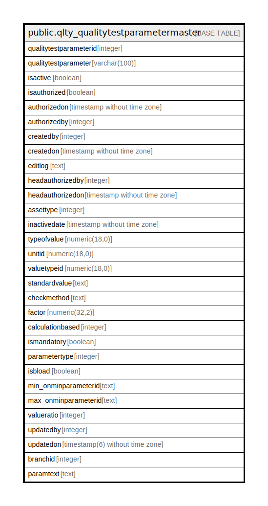

# public.qlty_qualitytestparametermaster

## Description

## Columns

| Name | Type | Default | Nullable | Children | Parents | Comment |
| ---- | ---- | ------- | -------- | -------- | ------- | ------- |
| qualitytestparameterid | integer | nextval('qlty_qualitytestparametermaster_qualitytestparameterid_seq'::regclass) | false |  |  |  |
| qualitytestparameter | varchar(100) |  | true |  |  |  |
| isactive | boolean | true | false |  |  |  |
| isauthorized | boolean | false | false |  |  |  |
| authorizedon | timestamp without time zone |  | true |  |  |  |
| authorizedby | integer |  | true |  |  |  |
| createdby | integer |  | true |  |  |  |
| createdon | timestamp without time zone | now() | true |  |  |  |
| editlog | text |  | true |  |  |  |
| headauthorizedby | integer |  | true |  |  |  |
| headauthorizedon | timestamp without time zone |  | true |  |  |  |
| assettype | integer |  | true |  |  |  |
| inactivedate | timestamp without time zone |  | true |  |  |  |
| typeofvalue | numeric(18,0) | 0 | true |  |  |  |
| unitid | numeric(18,0) | 0 | true |  |  |  |
| valuetypeid | numeric(18,0) | 1 | true |  |  |  |
| standardvalue | text |  | true |  |  |  |
| checkmethod | text |  | true |  |  |  |
| factor | numeric(32,2) |  | true |  |  |  |
| calculationbased | integer | 1 | true |  |  |  |
| ismandatory | boolean | true | true |  |  |  |
| parametertype | integer |  | true |  |  |  |
| isbload | boolean | false | true |  |  |  |
| min_onminparameterid | text | 0 | true |  |  |  |
| max_onminparameterid | text | 0 | true |  |  |  |
| valueratio | integer | 0 | true |  |  |  |
| updatedby | integer |  | true |  |  |  |
| updatedon | timestamp(6) without time zone | NULL::timestamp without time zone | true |  |  |  |
| branchid | integer | 0 | true |  |  |  |
| paramtext | text |  | true |  |  |  |

## Constraints

| Name | Type | Definition |
| ---- | ---- | ---------- |
| prod_qualitytestparameter_pkey | PRIMARY KEY | PRIMARY KEY (qualitytestparameterid) |
| prod_qualitytestparametermaster_qualitytestparameter_key | UNIQUE | UNIQUE (qualitytestparameter) |

## Indexes

| Name | Definition |
| ---- | ---------- |
| prod_qualitytestparameter_pkey | CREATE UNIQUE INDEX prod_qualitytestparameter_pkey ON public.qlty_qualitytestparametermaster USING btree (qualitytestparameterid) |
| prod_qualitytestparametermaster_qualitytestparameter_key | CREATE UNIQUE INDEX prod_qualitytestparametermaster_qualitytestparameter_key ON public.qlty_qualitytestparametermaster USING btree (qualitytestparameter) |

## Triggers

| Name | Definition |
| ---- | ---------- |
| qlty_qualitytestparametermaster_log_entry | CREATE TRIGGER qlty_qualitytestparametermaster_log_entry AFTER UPDATE ON public.qlty_qualitytestparametermaster FOR EACH ROW EXECUTE FUNCTION qlty_qualitytestparametermaster_log_entry() |

## Relations

---

> Generated by [tbls](https://github.com/k1LoW/tbls)
