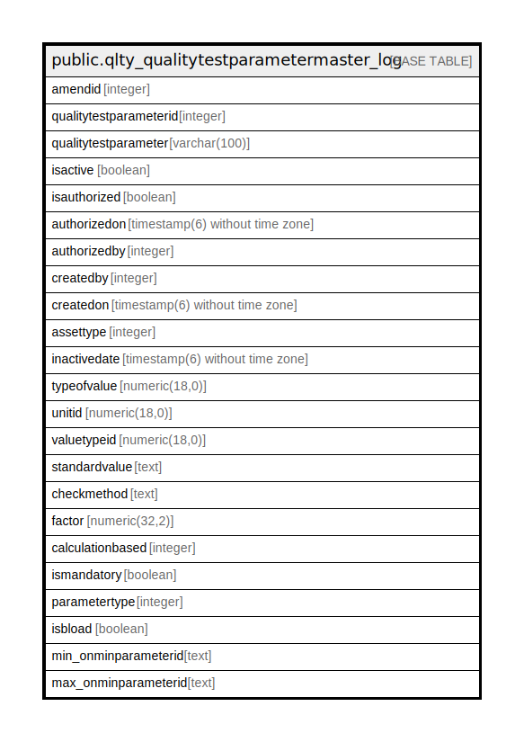

# public.qlty_qualitytestparametermaster_log

## Description

## Columns

| Name | Type | Default | Nullable | Children | Parents | Comment |
| ---- | ---- | ------- | -------- | -------- | ------- | ------- |
| amendid | integer | nextval('qlty_qualitytestparametermaster_log_amendid_seq'::regclass) | false |  |  |  |
| qualitytestparameterid | integer |  | false |  |  |  |
| qualitytestparameter | varchar(100) |  | true |  |  |  |
| isactive | boolean | true | false |  |  |  |
| isauthorized | boolean | false | false |  |  |  |
| authorizedon | timestamp(6) without time zone |  | true |  |  |  |
| authorizedby | integer |  | true |  |  |  |
| createdby | integer |  | true |  |  |  |
| createdon | timestamp(6) without time zone | now() | true |  |  |  |
| assettype | integer |  | true |  |  |  |
| inactivedate | timestamp(6) without time zone |  | true |  |  |  |
| typeofvalue | numeric(18,0) | 0 | true |  |  |  |
| unitid | numeric(18,0) | 0 | true |  |  |  |
| valuetypeid | numeric(18,0) | 1 | true |  |  |  |
| standardvalue | text |  | true |  |  |  |
| checkmethod | text |  | true |  |  |  |
| factor | numeric(32,2) |  | true |  |  |  |
| calculationbased | integer | 1 | true |  |  |  |
| ismandatory | boolean | true | true |  |  |  |
| parametertype | integer |  | true |  |  |  |
| isbload | boolean | false | true |  |  |  |
| min_onminparameterid | text | 0 | true |  |  |  |
| max_onminparameterid | text | 0 | true |  |  |  |

## Constraints

| Name | Type | Definition |
| ---- | ---- | ---------- |
| qlty_qualitytestparametermaster_log_key | UNIQUE | UNIQUE (amendid) |

## Indexes

| Name | Definition |
| ---- | ---------- |
| qlty_qualitytestparametermaster_log_key | CREATE UNIQUE INDEX qlty_qualitytestparametermaster_log_key ON public.qlty_qualitytestparametermaster_log USING btree (amendid) |

## Relations

---

> Generated by [tbls](https://github.com/k1LoW/tbls)
