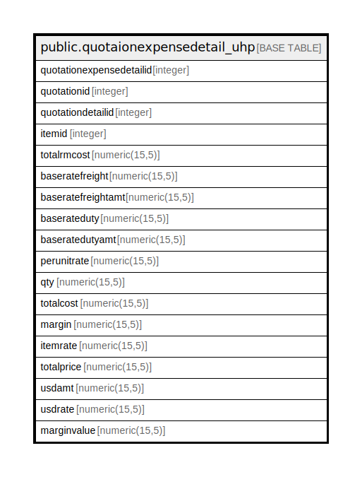

# public.quotaionexpensedetail_uhp

## Description

## Columns

| Name | Type | Default | Nullable | Children | Parents | Comment |
| ---- | ---- | ------- | -------- | -------- | ------- | ------- |
| quotationexpensedetailid | integer | nextval('quotaionexpensedetail_uhp_quotationexpensedetailid_seq'::regclass) | false |  |  |  |
| quotationid | integer |  | true |  |  |  |
| quotationdetailid | integer |  | true |  |  |  |
| itemid | integer |  | true |  |  |  |
| totalrmcost | numeric(15,5) |  | true |  |  |  |
| baseratefreight | numeric(15,5) |  | true |  |  |  |
| baseratefreightamt | numeric(15,5) |  | true |  |  |  |
| baserateduty | numeric(15,5) |  | true |  |  |  |
| baseratedutyamt | numeric(15,5) |  | true |  |  |  |
| perunitrate | numeric(15,5) |  | true |  |  |  |
| qty | numeric(15,5) |  | true |  |  |  |
| totalcost | numeric(15,5) |  | true |  |  |  |
| margin | numeric(15,5) |  | true |  |  |  |
| itemrate | numeric(15,5) |  | true |  |  |  |
| totalprice | numeric(15,5) |  | true |  |  |  |
| usdamt | numeric(15,5) |  | true |  |  |  |
| usdrate | numeric(15,5) |  | true |  |  |  |
| marginvalue | numeric(15,5) |  | true |  |  |  |

## Constraints

| Name | Type | Definition |
| ---- | ---- | ---------- |
| quotaionexpensedetail_uhp_pkey | PRIMARY KEY | PRIMARY KEY (quotationexpensedetailid) |

## Indexes

| Name | Definition |
| ---- | ---------- |
| quotaionexpensedetail_uhp_pkey | CREATE UNIQUE INDEX quotaionexpensedetail_uhp_pkey ON public.quotaionexpensedetail_uhp USING btree (quotationexpensedetailid) |

## Relations

---

> Generated by [tbls](https://github.com/k1LoW/tbls)
