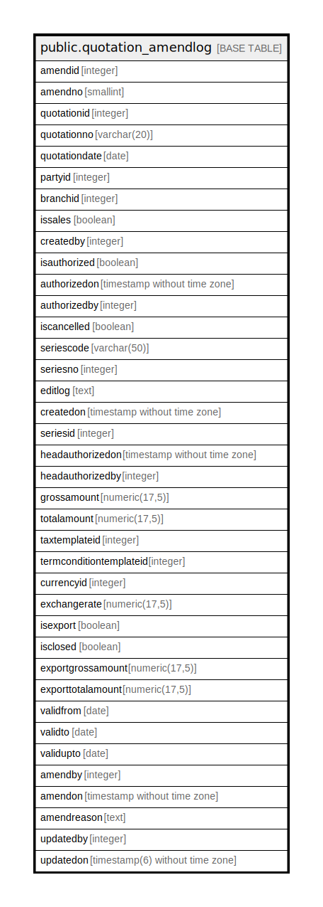

# public.quotation_amendlog

## Description

## Columns

| Name | Type | Default | Nullable | Children | Parents | Comment |
| ---- | ---- | ------- | -------- | -------- | ------- | ------- |
| amendid | integer | nextval('quotation_amendlog_amendid_seq'::regclass) | false |  |  |  |
| amendno | smallint |  | true |  |  |  |
| quotationid | integer |  | true |  |  |  |
| quotationno | varchar(20) |  | true |  |  |  |
| quotationdate | date |  | true |  |  |  |
| partyid | integer |  | true |  |  |  |
| branchid | integer |  | true |  |  |  |
| issales | boolean | true | false |  |  |  |
| createdby | integer |  | true |  |  |  |
| isauthorized | boolean | false | false |  |  |  |
| authorizedon | timestamp without time zone |  | true |  |  |  |
| authorizedby | integer |  | true |  |  |  |
| iscancelled | boolean | false | false |  |  |  |
| seriescode | varchar(50) |  | true |  |  |  |
| seriesno | integer |  | true |  |  |  |
| editlog | text |  | true |  |  |  |
| createdon | timestamp without time zone | now() | true |  |  |  |
| seriesid | integer |  | true |  |  |  |
| headauthorizedon | timestamp without time zone |  | true |  |  |  |
| headauthorizedby | integer |  | true |  |  |  |
| grossamount | numeric(17,5) |  | true |  |  |  |
| totalamount | numeric(17,5) |  | true |  |  |  |
| taxtemplateid | integer |  | true |  |  |  |
| termconditiontemplateid | integer |  | true |  |  |  |
| currencyid | integer |  | true |  |  |  |
| exchangerate | numeric(17,5) |  | true |  |  |  |
| isexport | boolean | false | true |  |  |  |
| isclosed | boolean | false | true |  |  |  |
| exportgrossamount | numeric(17,5) |  | true |  |  |  |
| exporttotalamount | numeric(17,5) |  | true |  |  |  |
| validfrom | date |  | true |  |  |  |
| validto | date |  | true |  |  |  |
| validupto | date |  | true |  |  |  |
| amendby | integer |  | true |  |  |  |
| amendon | timestamp without time zone |  | true |  |  |  |
| amendreason | text |  | true |  |  |  |
| updatedby | integer |  | true |  |  |  |
| updatedon | timestamp(6) without time zone | NULL::timestamp without time zone | true |  |  |  |

## Constraints

| Name | Type | Definition |
| ---- | ---- | ---------- |
| quotation_amendlog_pkey | PRIMARY KEY | PRIMARY KEY (amendid) |

## Indexes

| Name | Definition |
| ---- | ---------- |
| quotation_amendlog_pkey | CREATE UNIQUE INDEX quotation_amendlog_pkey ON public.quotation_amendlog USING btree (amendid) |

## Relations

---

> Generated by [tbls](https://github.com/k1LoW/tbls)
