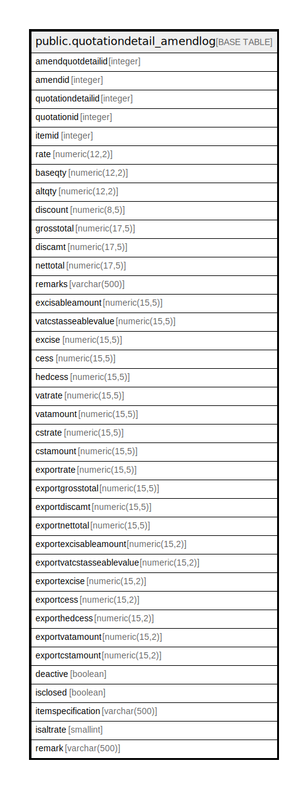

# public.quotationdetail_amendlog

## Description

## Columns

| Name | Type | Default | Nullable | Children | Parents | Comment |
| ---- | ---- | ------- | -------- | -------- | ------- | ------- |
| amendquotdetailid | integer | nextval('quotationdetail_amendlog_amendquotdetailid_seq'::regclass) | false |  |  |  |
| amendid | integer |  | true |  |  |  |
| quotationdetailid | integer |  | true |  |  |  |
| quotationid | integer |  | true |  |  |  |
| itemid | integer |  | true |  |  |  |
| rate | numeric(12,2) |  | true |  |  |  |
| baseqty | numeric(12,2) |  | true |  |  |  |
| altqty | numeric(12,2) |  | true |  |  |  |
| discount | numeric(8,5) |  | true |  |  |  |
| grosstotal | numeric(17,5) |  | true |  |  |  |
| discamt | numeric(17,5) |  | true |  |  |  |
| nettotal | numeric(17,5) |  | true |  |  |  |
| remarks | varchar(500) |  | true |  |  |  |
| excisableamount | numeric(15,5) | 0 | true |  |  |  |
| vatcstasseablevalue | numeric(15,5) | 0 | true |  |  |  |
| excise | numeric(15,5) | 0 | true |  |  |  |
| cess | numeric(15,5) | 0 | true |  |  |  |
| hedcess | numeric(15,5) | 0 | true |  |  |  |
| vatrate | numeric(15,5) | 0 | true |  |  |  |
| vatamount | numeric(15,5) | 0 | true |  |  |  |
| cstrate | numeric(15,5) | 0 | true |  |  |  |
| cstamount | numeric(15,5) | 0 | true |  |  |  |
| exportrate | numeric(15,5) | 0 | true |  |  |  |
| exportgrosstotal | numeric(15,5) | 0 | true |  |  |  |
| exportdiscamt | numeric(15,5) | 0 | true |  |  |  |
| exportnettotal | numeric(15,5) | 0 | true |  |  |  |
| exportexcisableamount | numeric(15,2) | 0 | true |  |  |  |
| exportvatcstasseablevalue | numeric(15,2) | 0 | true |  |  |  |
| exportexcise | numeric(15,2) | 0 | true |  |  |  |
| exportcess | numeric(15,2) | 0 | true |  |  |  |
| exporthedcess | numeric(15,2) | 0 | true |  |  |  |
| exportvatamount | numeric(15,2) | 0 | true |  |  |  |
| exportcstamount | numeric(15,2) | 0 | true |  |  |  |
| deactive | boolean | false | true |  |  |  |
| isclosed | boolean | false | true |  |  |  |
| itemspecification | varchar(500) |  | true |  |  |  |
| isaltrate | smallint | 0 | true |  |  |  |
| remark | varchar(500) |  | true |  |  |  |

## Constraints

| Name | Type | Definition |
| ---- | ---- | ---------- |
| quotationdetail_amendlog_pkey | PRIMARY KEY | PRIMARY KEY (amendquotdetailid) |

## Indexes

| Name | Definition |
| ---- | ---------- |
| quotationdetail_amendlog_pkey | CREATE UNIQUE INDEX quotationdetail_amendlog_pkey ON public.quotationdetail_amendlog USING btree (amendquotdetailid) |

## Relations

---

> Generated by [tbls](https://github.com/k1LoW/tbls)
