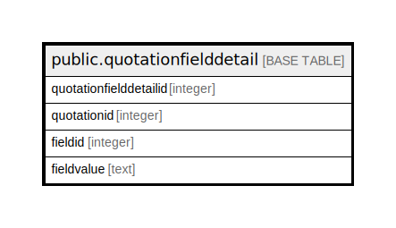

# public.quotationfielddetail

## Description

## Columns

| Name | Type | Default | Nullable | Children | Parents | Comment |
| ---- | ---- | ------- | -------- | -------- | ------- | ------- |
| quotationfielddetailid | integer | nextval('quotationfielddetail_quotationfielddetailid_seq'::regclass) | false |  |  |  |
| quotationid | integer |  | true |  |  |  |
| fieldid | integer |  | true |  |  |  |
| fieldvalue | text |  | true |  |  |  |

## Constraints

| Name | Type | Definition |
| ---- | ---- | ---------- |
| quotationfielddetail_pkey | PRIMARY KEY | PRIMARY KEY (quotationfielddetailid) |

## Indexes

| Name | Definition |
| ---- | ---------- |
| quotationfielddetail_pkey | CREATE UNIQUE INDEX quotationfielddetail_pkey ON public.quotationfielddetail USING btree (quotationfielddetailid) |
| Index_PQ_FielDet_PQID | CREATE INDEX "Index_PQ_FielDet_PQID" ON public.quotationfielddetail USING btree (quotationid) |

## Relations

---

> Generated by [tbls](https://github.com/k1LoW/tbls)
