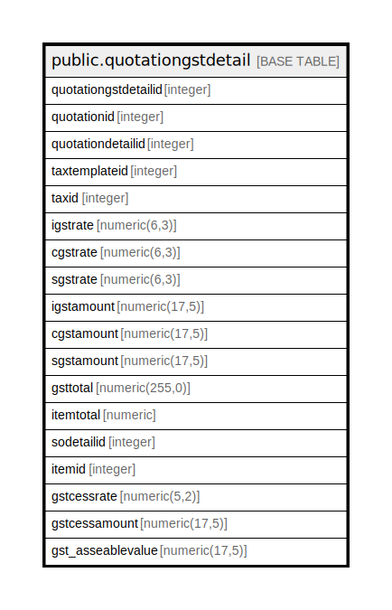

# public.quotationgstdetail

## Description

## Columns

| Name | Type | Default | Nullable | Children | Parents | Comment |
| ---- | ---- | ------- | -------- | -------- | ------- | ------- |
| quotationgstdetailid | integer | nextval('quotationgstdetail_quotationgstdetailid_seq'::regclass) | false |  |  |  |
| quotationid | integer |  | true |  |  |  |
| quotationdetailid | integer |  | true |  |  |  |
| taxtemplateid | integer |  | true |  |  |  |
| taxid | integer |  | true |  |  |  |
| igstrate | numeric(6,3) |  | true |  |  |  |
| cgstrate | numeric(6,3) |  | true |  |  |  |
| sgstrate | numeric(6,3) |  | true |  |  |  |
| igstamount | numeric(17,5) | 0 | true |  |  |  |
| cgstamount | numeric(17,5) | 0 | true |  |  |  |
| sgstamount | numeric(17,5) | 0 | true |  |  |  |
| gsttotal | numeric(255,0) |  | true |  |  |  |
| itemtotal | numeric |  | true |  |  |  |
| sodetailid | integer |  | true |  |  |  |
| itemid | integer |  | true |  |  |  |
| gstcessrate | numeric(5,2) |  | true |  |  |  |
| gstcessamount | numeric(17,5) | 0 | true |  |  |  |
| gst_asseablevalue | numeric(17,5) |  | true |  |  |  |

## Constraints

| Name | Type | Definition |
| ---- | ---- | ---------- |
| quotationgstdetail_pkey | PRIMARY KEY | PRIMARY KEY (quotationgstdetailid) |

## Indexes

| Name | Definition |
| ---- | ---------- |
| quotationgstdetail_pkey | CREATE UNIQUE INDEX quotationgstdetail_pkey ON public.quotationgstdetail USING btree (quotationgstdetailid) |
| Index_PQ_GSTDet_PQID | CREATE INDEX "Index_PQ_GSTDet_PQID" ON public.quotationgstdetail USING btree (quotationid) |

## Relations

---

> Generated by [tbls](https://github.com/k1LoW/tbls)
