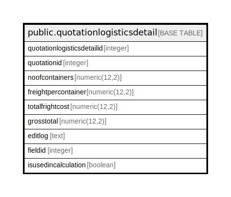

# public.quotationlogisticsdetail

## Description

## Columns

| Name | Type | Default | Nullable | Children | Parents | Comment |
| ---- | ---- | ------- | -------- | -------- | ------- | ------- |
| quotationlogisticsdetailid | integer | nextval('quotationlogisticsdetail_quotationlogisticsdetailid_seq'::regclass) | false |  |  |  |
| quotationid | integer |  | true |  |  |  |
| noofcontainers | numeric(12,2) |  | true |  |  |  |
| freightpercontainer | numeric(12,2) |  | true |  |  |  |
| totalfrightcost | numeric(12,2) |  | true |  |  |  |
| grosstotal | numeric(12,2) |  | true |  |  |  |
| editlog | text |  | true |  |  |  |
| fieldid | integer |  | true |  |  |  |
| isusedincalculation | boolean | false | true |  |  |  |

## Constraints

| Name | Type | Definition |
| ---- | ---- | ---------- |
| quotationlogisticsdetail_pkey | PRIMARY KEY | PRIMARY KEY (quotationlogisticsdetailid) |

## Indexes

| Name | Definition |
| ---- | ---------- |
| quotationlogisticsdetail_pkey | CREATE UNIQUE INDEX quotationlogisticsdetail_pkey ON public.quotationlogisticsdetail USING btree (quotationlogisticsdetailid) |

## Relations

---

> Generated by [tbls](https://github.com/k1LoW/tbls)
