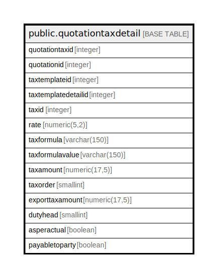

# public.quotationtaxdetail

## Description

## Columns

| Name | Type | Default | Nullable | Children | Parents | Comment |
| ---- | ---- | ------- | -------- | -------- | ------- | ------- |
| quotationtaxid | integer | nextval('quotationtaxdetail_quotationtaxid_seq'::regclass) | false |  |  |  |
| quotationid | integer |  | true |  |  |  |
| taxtemplateid | integer |  | true |  |  |  |
| taxtemplatedetailid | integer |  | true |  |  |  |
| taxid | integer |  | true |  |  |  |
| rate | numeric(5,2) |  | true |  |  |  |
| taxformula | varchar(150) |  | true |  |  |  |
| taxformulavalue | varchar(150) |  | true |  |  |  |
| taxamount | numeric(17,5) | 0 | true |  |  |  |
| taxorder | smallint |  | true |  |  |  |
| exporttaxamount | numeric(17,5) | NULL::numeric | true |  |  |  |
| dutyhead | smallint |  | true |  |  |  |
| asperactual | boolean | false | true |  |  |  |
| payabletoparty | boolean | true | true |  |  |  |

## Constraints

| Name | Type | Definition |
| ---- | ---- | ---------- |
| quotationtaxdetail_pkey | PRIMARY KEY | PRIMARY KEY (quotationtaxid) |

## Indexes

| Name | Definition |
| ---- | ---------- |
| quotationtaxdetail_pkey | CREATE UNIQUE INDEX quotationtaxdetail_pkey ON public.quotationtaxdetail USING btree (quotationtaxid) |
| Index_PQ_TaxDet_PQID | CREATE INDEX "Index_PQ_TaxDet_PQID" ON public.quotationtaxdetail USING btree (quotationid) |

## Relations

---

> Generated by [tbls](https://github.com/k1LoW/tbls)
