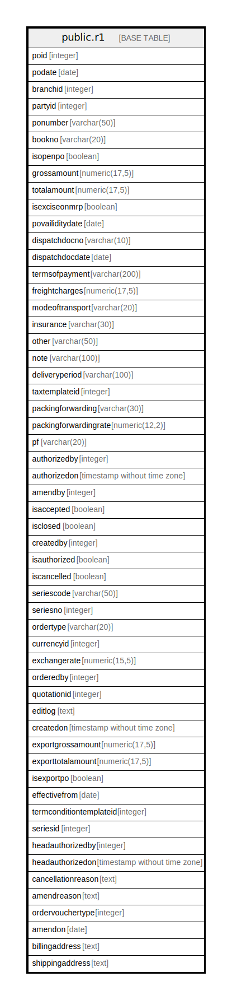

# public.r1

## Description

## Columns

| Name | Type | Default | Nullable | Children | Parents | Comment |
| ---- | ---- | ------- | -------- | -------- | ------- | ------- |
| poid | integer |  | true |  |  |  |
| podate | date |  | true |  |  |  |
| branchid | integer |  | true |  |  |  |
| partyid | integer |  | true |  |  |  |
| ponumber | varchar(50) |  | true |  |  |  |
| bookno | varchar(20) |  | true |  |  |  |
| isopenpo | boolean |  | true |  |  |  |
| grossamount | numeric(17,5) |  | true |  |  |  |
| totalamount | numeric(17,5) |  | true |  |  |  |
| isexciseonmrp | boolean |  | true |  |  |  |
| povailiditydate | date |  | true |  |  |  |
| dispatchdocno | varchar(10) |  | true |  |  |  |
| dispatchdocdate | date |  | true |  |  |  |
| termsofpayment | varchar(200) |  | true |  |  |  |
| freightcharges | numeric(17,5) |  | true |  |  |  |
| modeoftransport | varchar(20) |  | true |  |  |  |
| insurance | varchar(30) |  | true |  |  |  |
| other | varchar(50) |  | true |  |  |  |
| note | varchar(100) |  | true |  |  |  |
| deliveryperiod | varchar(100) |  | true |  |  |  |
| taxtemplateid | integer |  | true |  |  |  |
| packingforwarding | varchar(30) |  | true |  |  |  |
| packingforwardingrate | numeric(12,2) |  | true |  |  |  |
| pf | varchar(20) |  | true |  |  |  |
| authorizedby | integer |  | true |  |  |  |
| authorizedon | timestamp without time zone |  | true |  |  |  |
| amendby | integer |  | true |  |  |  |
| isaccepted | boolean |  | true |  |  |  |
| isclosed | boolean |  | true |  |  |  |
| createdby | integer |  | true |  |  |  |
| isauthorized | boolean |  | true |  |  |  |
| iscancelled | boolean |  | true |  |  |  |
| seriescode | varchar(50) |  | true |  |  |  |
| seriesno | integer |  | true |  |  |  |
| ordertype | varchar(20) |  | true |  |  |  |
| currencyid | integer |  | true |  |  |  |
| exchangerate | numeric(15,5) |  | true |  |  |  |
| orderedby | integer |  | true |  |  |  |
| quotationid | integer |  | true |  |  |  |
| editlog | text |  | true |  |  |  |
| createdon | timestamp without time zone |  | true |  |  |  |
| exportgrossamount | numeric(17,5) |  | true |  |  |  |
| exporttotalamount | numeric(17,5) |  | true |  |  |  |
| isexportpo | boolean |  | true |  |  |  |
| effectivefrom | date |  | true |  |  |  |
| termconditiontemplateid | integer |  | true |  |  |  |
| seriesid | integer |  | true |  |  |  |
| headauthorizedby | integer |  | true |  |  |  |
| headauthorizedon | timestamp without time zone |  | true |  |  |  |
| cancellationreason | text |  | true |  |  |  |
| amendreason | text |  | true |  |  |  |
| ordervouchertype | integer |  | true |  |  |  |
| amendon | date |  | true |  |  |  |
| billingaddress | text |  | true |  |  |  |
| shippingaddress | text |  | true |  |  |  |

## Relations

---

> Generated by [tbls](https://github.com/k1LoW/tbls)
