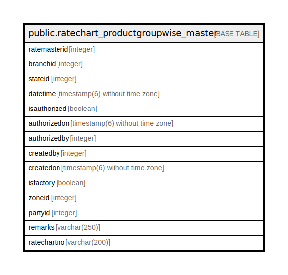

# public.ratechart_productgroupwise_master

## Description

## Columns

| Name | Type | Default | Nullable | Children | Parents | Comment |
| ---- | ---- | ------- | -------- | -------- | ------- | ------- |
| ratemasterid | integer | nextval('ratechart_productgroupwise_master_ratemasterid_seq'::regclass) | false |  |  |  |
| branchid | integer |  | true |  |  |  |
| stateid | integer |  | true |  |  |  |
| datetime | timestamp(6) without time zone | now() | true |  |  |  |
| isauthorized | boolean | false | false |  |  |  |
| authorizedon | timestamp(6) without time zone |  | true |  |  |  |
| authorizedby | integer |  | true |  |  |  |
| createdby | integer |  | true |  |  |  |
| createdon | timestamp(6) without time zone | now() | true |  |  |  |
| isfactory | boolean | false | true |  |  |  |
| zoneid | integer | 0 | true |  |  |  |
| partyid | integer | 0 | true |  |  |  |
| remarks | varchar(250) | NULL::character varying | true |  |  |  |
| ratechartno | varchar(200) | NULL::character varying | true |  |  |  |

## Constraints

| Name | Type | Definition |
| ---- | ---- | ---------- |
| ratechart_productgroupwise_master_pkey | PRIMARY KEY | PRIMARY KEY (ratemasterid) |

## Indexes

| Name | Definition |
| ---- | ---------- |
| ratechart_productgroupwise_master_pkey | CREATE UNIQUE INDEX ratechart_productgroupwise_master_pkey ON public.ratechart_productgroupwise_master USING btree (ratemasterid) |

## Relations

---

> Generated by [tbls](https://github.com/k1LoW/tbls)
