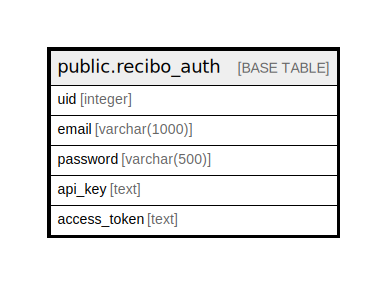

# public.recibo_auth

## Description

## Columns

| Name | Type | Default | Nullable | Children | Parents | Comment |
| ---- | ---- | ------- | -------- | -------- | ------- | ------- |
| uid | integer | nextval('recibo_auth_uid_seq'::regclass) | false |  |  |  |
| email | varchar(1000) |  | true |  |  |  |
| password | varchar(500) |  | true |  |  |  |
| api_key | text |  | true |  |  |  |
| access_token | text |  | true |  |  |  |

## Constraints

| Name | Type | Definition |
| ---- | ---- | ---------- |
| recibo_auth_pkey | PRIMARY KEY | PRIMARY KEY (uid) |

## Indexes

| Name | Definition |
| ---- | ---------- |
| recibo_auth_pkey | CREATE UNIQUE INDEX recibo_auth_pkey ON public.recibo_auth USING btree (uid) |

## Relations

---

> Generated by [tbls](https://github.com/k1LoW/tbls)
