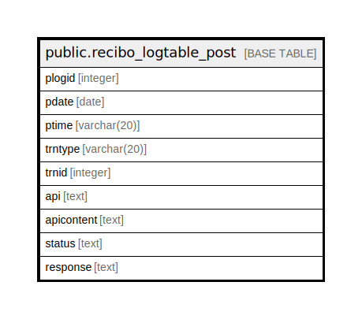

# public.recibo_logtable_post

## Description

## Columns

| Name | Type | Default | Nullable | Children | Parents | Comment |
| ---- | ---- | ------- | -------- | -------- | ------- | ------- |
| plogid | integer | nextval('recibo_logtable_post_plogid_seq'::regclass) | false |  |  |  |
| pdate | date |  | true |  |  |  |
| ptime | varchar(20) |  | true |  |  |  |
| trntype | varchar(20) |  | true |  |  |  |
| trnid | integer |  | true |  |  |  |
| api | text |  | true |  |  |  |
| apicontent | text |  | true |  |  |  |
| status | text |  | true |  |  |  |
| response | text |  | true |  |  |  |

## Constraints

| Name | Type | Definition |
| ---- | ---- | ---------- |
| recibo_logtable_post_pkey | PRIMARY KEY | PRIMARY KEY (plogid) |

## Indexes

| Name | Definition |
| ---- | ---------- |
| recibo_logtable_post_pkey | CREATE UNIQUE INDEX recibo_logtable_post_pkey ON public.recibo_logtable_post USING btree (plogid) |

## Relations

---

> Generated by [tbls](https://github.com/k1LoW/tbls)
