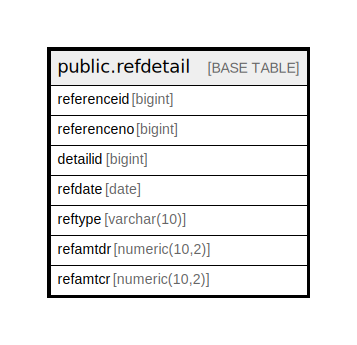

# public.refdetail

## Description

## Columns

| Name | Type | Default | Nullable | Children | Parents | Comment |
| ---- | ---- | ------- | -------- | -------- | ------- | ------- |
| referenceid | bigint | nextval('refdetail_refereceid_seq'::regclass) | false |  |  |  |
| referenceno | bigint |  | true |  |  |  |
| detailid | bigint |  | true |  |  |  |
| refdate | date |  | true |  |  |  |
| reftype | varchar(10) |  | true |  |  |  |
| refamtdr | numeric(10,2) |  | true |  |  |  |
| refamtcr | numeric(10,2) |  | true |  |  |  |

## Constraints

| Name | Type | Definition |
| ---- | ---- | ---------- |
| references_pkey | PRIMARY KEY | PRIMARY KEY (referenceid) |

## Indexes

| Name | Definition |
| ---- | ---------- |
| references_pkey | CREATE UNIQUE INDEX references_pkey ON public.refdetail USING btree (referenceid) |

## Relations

---

> Generated by [tbls](https://github.com/k1LoW/tbls)
