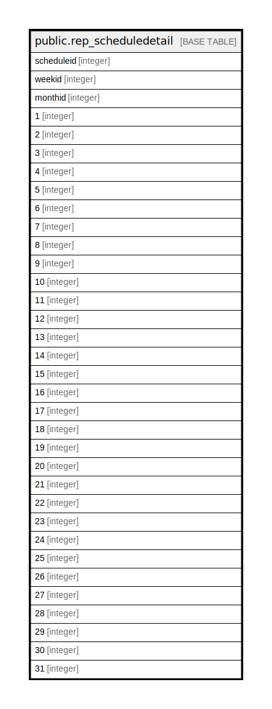

# public.rep_scheduledetail

## Description

## Columns

| Name | Type | Default | Nullable | Children | Parents | Comment |
| ---- | ---- | ------- | -------- | -------- | ------- | ------- |
| scheduleid | integer |  | false |  |  |  |
| weekid | integer |  | true |  |  |  |
| monthid | integer |  | true |  |  |  |
| 1 | integer |  | true |  |  |  |
| 2 | integer |  | true |  |  |  |
| 3 | integer |  | true |  |  |  |
| 4 | integer |  | true |  |  |  |
| 5 | integer |  | true |  |  |  |
| 6 | integer |  | true |  |  |  |
| 7 | integer |  | true |  |  |  |
| 8 | integer |  | true |  |  |  |
| 9 | integer |  | true |  |  |  |
| 10 | integer |  | true |  |  |  |
| 11 | integer |  | true |  |  |  |
| 12 | integer |  | true |  |  |  |
| 13 | integer |  | true |  |  |  |
| 14 | integer |  | true |  |  |  |
| 15 | integer |  | true |  |  |  |
| 16 | integer |  | true |  |  |  |
| 17 | integer |  | true |  |  |  |
| 18 | integer |  | true |  |  |  |
| 19 | integer |  | true |  |  |  |
| 20 | integer |  | true |  |  |  |
| 21 | integer |  | true |  |  |  |
| 22 | integer |  | true |  |  |  |
| 23 | integer |  | true |  |  |  |
| 24 | integer |  | true |  |  |  |
| 25 | integer |  | true |  |  |  |
| 26 | integer |  | true |  |  |  |
| 27 | integer |  | true |  |  |  |
| 28 | integer |  | true |  |  |  |
| 29 | integer |  | true |  |  |  |
| 30 | integer |  | true |  |  |  |
| 31 | integer |  | true |  |  |  |

## Relations

---

> Generated by [tbls](https://github.com/k1LoW/tbls)
