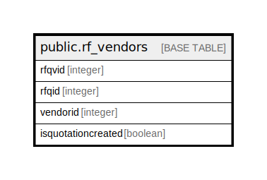

# public.rf_vendors

## Description

## Columns

| Name | Type | Default | Nullable | Children | Parents | Comment |
| ---- | ---- | ------- | -------- | -------- | ------- | ------- |
| rfqvid | integer | nextval('rf_vendors_rfqvid_seq'::regclass) | false |  |  |  |
| rfqid | integer |  | true |  |  |  |
| vendorid | integer |  | true |  |  |  |
| isquotationcreated | boolean | false | true |  |  |  |

## Constraints

| Name | Type | Definition |
| ---- | ---- | ---------- |
| pk_rf_vendors | PRIMARY KEY | PRIMARY KEY (rfqvid) |

## Indexes

| Name | Definition |
| ---- | ---------- |
| pk_rf_vendors | CREATE UNIQUE INDEX pk_rf_vendors ON public.rf_vendors USING btree (rfqvid) |

## Relations

---

> Generated by [tbls](https://github.com/k1LoW/tbls)
