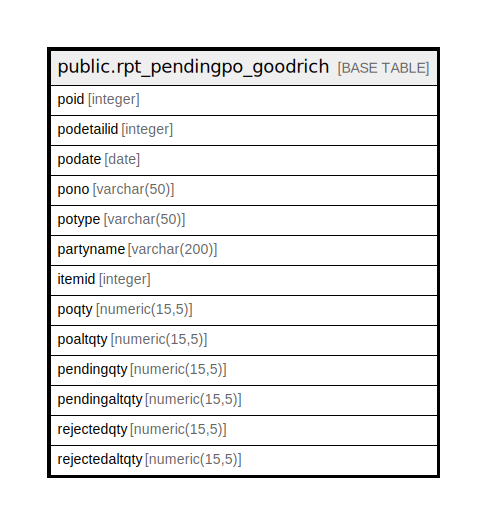

# public.rpt_pendingpo_goodrich

## Description

## Columns

| Name | Type | Default | Nullable | Children | Parents | Comment |
| ---- | ---- | ------- | -------- | -------- | ------- | ------- |
| poid | integer |  | true |  |  |  |
| podetailid | integer |  | true |  |  |  |
| podate | date |  | true |  |  |  |
| pono | varchar(50) |  | true |  |  |  |
| potype | varchar(50) |  | true |  |  |  |
| partyname | varchar(200) |  | true |  |  |  |
| itemid | integer |  | true |  |  |  |
| poqty | numeric(15,5) |  | true |  |  |  |
| poaltqty | numeric(15,5) |  | true |  |  |  |
| pendingqty | numeric(15,5) |  | true |  |  |  |
| pendingaltqty | numeric(15,5) |  | true |  |  |  |
| rejectedqty | numeric(15,5) |  | true |  |  |  |
| rejectedaltqty | numeric(15,5) |  | true |  |  |  |

## Relations

---

> Generated by [tbls](https://github.com/k1LoW/tbls)
