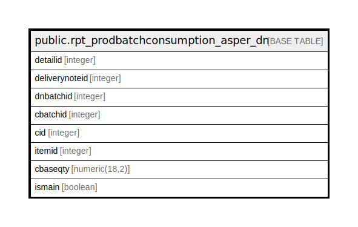

# public.rpt_prodbatchconsumption_asper_dn

## Description

## Columns

| Name | Type | Default | Nullable | Children | Parents | Comment |
| ---- | ---- | ------- | -------- | -------- | ------- | ------- |
| detailid | integer | nextval('rpt_prodbatchconsumption_asper_dn_detailid_seq'::regclass) | false |  |  |  |
| deliverynoteid | integer |  | true |  |  |  |
| dnbatchid | integer |  | true |  |  |  |
| cbatchid | integer |  | true |  |  |  |
| cid | integer |  | true |  |  |  |
| itemid | integer |  | true |  |  |  |
| cbaseqty | numeric(18,2) |  | true |  |  |  |
| ismain | boolean |  | true |  |  |  |

## Constraints

| Name | Type | Definition |
| ---- | ---- | ---------- |
| pkey_rpt_prodbatchconsumption_asper_dn | PRIMARY KEY | PRIMARY KEY (detailid) |

## Indexes

| Name | Definition |
| ---- | ---------- |
| pkey_rpt_prodbatchconsumption_asper_dn | CREATE UNIQUE INDEX pkey_rpt_prodbatchconsumption_asper_dn ON public.rpt_prodbatchconsumption_asper_dn USING btree (detailid) |

## Relations

---

> Generated by [tbls](https://github.com/k1LoW/tbls)
