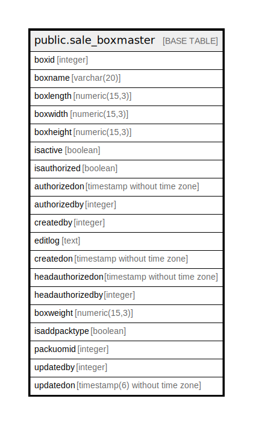

# public.sale_boxmaster

## Description

## Columns

| Name | Type | Default | Nullable | Children | Parents | Comment |
| ---- | ---- | ------- | -------- | -------- | ------- | ------- |
| boxid | integer | nextval('sale_boxmaster_boxid_seq'::regclass) | false |  |  |  |
| boxname | varchar(20) | ''::character varying | true |  |  |  |
| boxlength | numeric(15,3) | 0 | true |  |  |  |
| boxwidth | numeric(15,3) | 0 | true |  |  |  |
| boxheight | numeric(15,3) | 0 | true |  |  |  |
| isactive | boolean | true | false |  |  |  |
| isauthorized | boolean | false | false |  |  |  |
| authorizedon | timestamp without time zone |  | true |  |  |  |
| authorizedby | integer |  | true |  |  |  |
| createdby | integer |  | true |  |  |  |
| editlog | text |  | true |  |  |  |
| createdon | timestamp without time zone | now() | true |  |  |  |
| headauthorizedon | timestamp without time zone |  | true |  |  |  |
| headauthorizedby | integer |  | true |  |  |  |
| boxweight | numeric(15,3) | 0 | false |  |  |  |
| isaddpacktype | boolean |  | true |  |  |  |
| packuomid | integer | 0 | false |  |  |  |
| updatedby | integer |  | true |  |  |  |
| updatedon | timestamp(6) without time zone | NULL::timestamp without time zone | true |  |  |  |

## Constraints

| Name | Type | Definition |
| ---- | ---- | ---------- |
| sale_boxmaster_boxid_pkey | PRIMARY KEY | PRIMARY KEY (boxid) |
| sale_boxmaster_boxname_key | UNIQUE | UNIQUE (boxname) |

## Indexes

| Name | Definition |
| ---- | ---------- |
| sale_boxmaster_boxid_pkey | CREATE UNIQUE INDEX sale_boxmaster_boxid_pkey ON public.sale_boxmaster USING btree (boxid) |
| sale_boxmaster_boxname_key | CREATE UNIQUE INDEX sale_boxmaster_boxname_key ON public.sale_boxmaster USING btree (boxname) |

## Relations

---

> Generated by [tbls](https://github.com/k1LoW/tbls)
