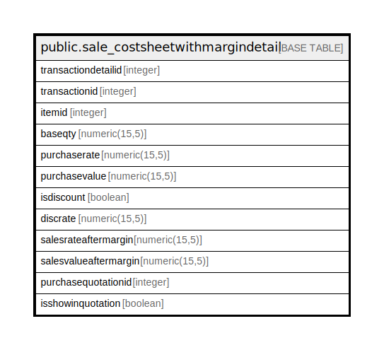

# public.sale_costsheetwithmargindetail

## Description

## Columns

| Name | Type | Default | Nullable | Children | Parents | Comment |
| ---- | ---- | ------- | -------- | -------- | ------- | ------- |
| transactiondetailid | integer | nextval('sale_costsheetwithmargindetail_transactiondetailid_seq'::regclass) | false |  |  |  |
| transactionid | integer |  | true |  |  |  |
| itemid | integer |  | true |  |  |  |
| baseqty | numeric(15,5) |  | true |  |  |  |
| purchaserate | numeric(15,5) |  | true |  |  |  |
| purchasevalue | numeric(15,5) |  | true |  |  |  |
| isdiscount | boolean | false | true |  |  |  |
| discrate | numeric(15,5) |  | true |  |  |  |
| salesrateaftermargin | numeric(15,5) |  | true |  |  |  |
| salesvalueaftermargin | numeric(15,5) |  | true |  |  |  |
| purchasequotationid | integer |  | true |  |  |  |
| isshowinquotation | boolean | true | true |  |  |  |

## Relations

---

> Generated by [tbls](https://github.com/k1LoW/tbls)
