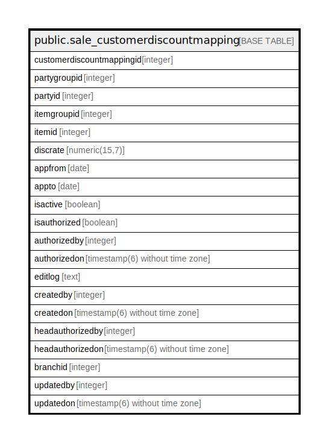

# public.sale_customerdiscountmapping

## Description

## Columns

| Name | Type | Default | Nullable | Children | Parents | Comment |
| ---- | ---- | ------- | -------- | -------- | ------- | ------- |
| customerdiscountmappingid | integer | nextval('sale_customerdiscountmapping_customerdiscountmappingid_seq'::regclass) | false |  |  |  |
| partygroupid | integer |  | true |  |  |  |
| partyid | integer |  | true |  |  |  |
| itemgroupid | integer |  | true |  |  |  |
| itemid | integer |  | true |  |  |  |
| discrate | numeric(15,7) |  | true |  |  |  |
| appfrom | date |  | true |  |  |  |
| appto | date |  | true |  |  |  |
| isactive | boolean | false | false |  |  |  |
| isauthorized | boolean | false | false |  |  |  |
| authorizedby | integer |  | true |  |  |  |
| authorizedon | timestamp(6) without time zone |  | true |  |  |  |
| editlog | text |  | true |  |  |  |
| createdby | integer |  | true |  |  |  |
| createdon | timestamp(6) without time zone | now() | true |  |  |  |
| headauthorizedby | integer |  | true |  |  |  |
| headauthorizedon | timestamp(6) without time zone |  | true |  |  |  |
| branchid | integer |  | true |  |  |  |
| updatedby | integer |  | true |  |  |  |
| updatedon | timestamp(6) without time zone | NULL::timestamp without time zone | true |  |  |  |

## Constraints

| Name | Type | Definition |
| ---- | ---- | ---------- |
| sale_customerdiscountmapping_pkey | PRIMARY KEY | PRIMARY KEY (customerdiscountmappingid) |

## Indexes

| Name | Definition |
| ---- | ---------- |
| sale_customerdiscountmapping_pkey | CREATE UNIQUE INDEX sale_customerdiscountmapping_pkey ON public.sale_customerdiscountmapping USING btree (customerdiscountmappingid) |

## Relations

---

> Generated by [tbls](https://github.com/k1LoW/tbls)
