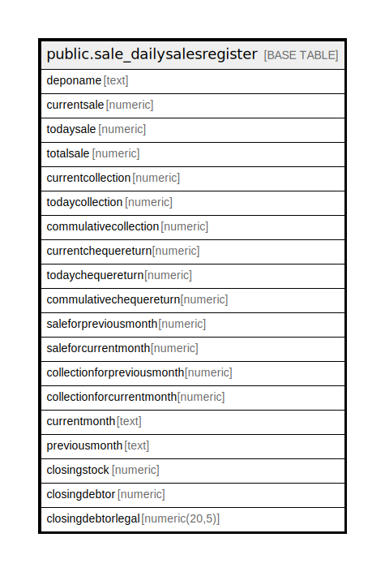

# public.sale_dailysalesregister

## Description

## Columns

| Name | Type | Default | Nullable | Children | Parents | Comment |
| ---- | ---- | ------- | -------- | -------- | ------- | ------- |
| deponame | text |  | true |  |  |  |
| currentsale | numeric |  | true |  |  |  |
| todaysale | numeric |  | true |  |  |  |
| totalsale | numeric |  | true |  |  |  |
| currentcollection | numeric |  | true |  |  |  |
| todaycollection | numeric |  | true |  |  |  |
| commulativecollection | numeric |  | true |  |  |  |
| currentchequereturn | numeric |  | true |  |  |  |
| todaychequereturn | numeric |  | true |  |  |  |
| commulativechequereturn | numeric |  | true |  |  |  |
| saleforpreviousmonth | numeric |  | true |  |  |  |
| saleforcurrentmonth | numeric |  | true |  |  |  |
| collectionforpreviousmonth | numeric |  | true |  |  |  |
| collectionforcurrentmonth | numeric |  | true |  |  |  |
| currentmonth | text |  | true |  |  |  |
| previousmonth | text |  | true |  |  |  |
| closingstock | numeric |  | true |  |  |  |
| closingdebtor | numeric |  | true |  |  |  |
| closingdebtorlegal | numeric(20,5) |  | true |  |  |  |

## Relations

---

> Generated by [tbls](https://github.com/k1LoW/tbls)
