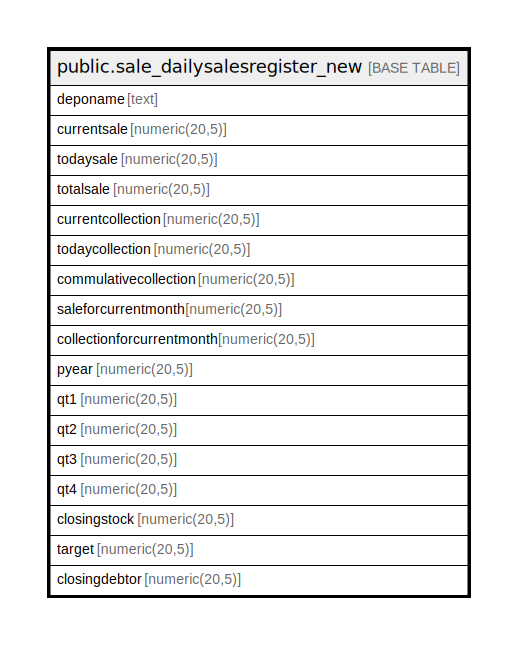

# public.sale_dailysalesregister_new

## Description

## Columns

| Name | Type | Default | Nullable | Children | Parents | Comment |
| ---- | ---- | ------- | -------- | -------- | ------- | ------- |
| deponame | text |  | true |  |  |  |
| currentsale | numeric(20,5) |  | true |  |  |  |
| todaysale | numeric(20,5) |  | true |  |  |  |
| totalsale | numeric(20,5) |  | true |  |  |  |
| currentcollection | numeric(20,5) |  | true |  |  |  |
| todaycollection | numeric(20,5) |  | true |  |  |  |
| commulativecollection | numeric(20,5) |  | true |  |  |  |
| saleforcurrentmonth | numeric(20,5) |  | true |  |  |  |
| collectionforcurrentmonth | numeric(20,5) |  | true |  |  |  |
| pyear | numeric(20,5) |  | true |  |  |  |
| qt1 | numeric(20,5) |  | true |  |  |  |
| qt2 | numeric(20,5) |  | true |  |  |  |
| qt3 | numeric(20,5) |  | true |  |  |  |
| qt4 | numeric(20,5) |  | true |  |  |  |
| closingstock | numeric(20,5) |  | true |  |  |  |
| target | numeric(20,5) |  | true |  |  |  |
| closingdebtor | numeric(20,5) |  | true |  |  |  |

## Relations

---

> Generated by [tbls](https://github.com/k1LoW/tbls)
