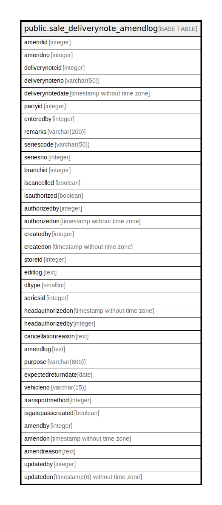

# public.sale_deliverynote_amendlog

## Description

## Columns

| Name | Type | Default | Nullable | Children | Parents | Comment |
| ---- | ---- | ------- | -------- | -------- | ------- | ------- |
| amendid | integer | nextval('sale_deliverynote_amendlog_amendid_seq'::regclass) | false |  |  |  |
| amendno | integer |  | true |  |  |  |
| deliverynoteid | integer |  | true |  |  |  |
| deliverynoteno | varchar(50) |  | true |  |  |  |
| deliverynotedate | timestamp without time zone |  | true |  |  |  |
| partyid | integer |  | true |  |  |  |
| enteredby | integer |  | true |  |  |  |
| remarks | varchar(200) |  | true |  |  |  |
| seriescode | varchar(50) |  | true |  |  |  |
| seriesno | integer |  | true |  |  |  |
| branchid | integer |  | true |  |  |  |
| iscancelled | boolean | false | false |  |  |  |
| isauthorized | boolean | false | false |  |  |  |
| authorizedby | integer |  | true |  |  |  |
| authorizedon | timestamp without time zone |  | true |  |  |  |
| createdby | integer |  | true |  |  |  |
| createdon | timestamp without time zone | now() | false |  |  |  |
| storeid | integer |  | true |  |  |  |
| editlog | text |  | true |  |  |  |
| dltype | smallint | 0 | false |  |  |  |
| seriesid | integer |  | true |  |  |  |
| headauthorizedon | timestamp without time zone |  | true |  |  |  |
| headauthorizedby | integer |  | true |  |  |  |
| cancellationreason | text |  | true |  |  |  |
| amendlog | text |  | true |  |  |  |
| purpose | varchar(800) |  | true |  |  |  |
| expectedreturndate | date |  | true |  |  |  |
| vehicleno | varchar(15) |  | true |  |  |  |
| transportmethod | integer | 0 | false |  |  |  |
| isgatepasscreated | boolean | false | true |  |  |  |
| amendby | integer |  | true |  |  |  |
| amendon | timestamp without time zone |  | true |  |  |  |
| amendreason | text |  | true |  |  |  |
| updatedby | integer |  | true |  |  |  |
| updatedon | timestamp(6) without time zone | NULL::timestamp without time zone | true |  |  |  |

## Constraints

| Name | Type | Definition |
| ---- | ---- | ---------- |
| sale_deliverynote_amendlog_pkey | PRIMARY KEY | PRIMARY KEY (amendid) |

## Indexes

| Name | Definition |
| ---- | ---------- |
| sale_deliverynote_amendlog_pkey | CREATE UNIQUE INDEX sale_deliverynote_amendlog_pkey ON public.sale_deliverynote_amendlog USING btree (amendid) |

## Relations

---

> Generated by [tbls](https://github.com/k1LoW/tbls)
