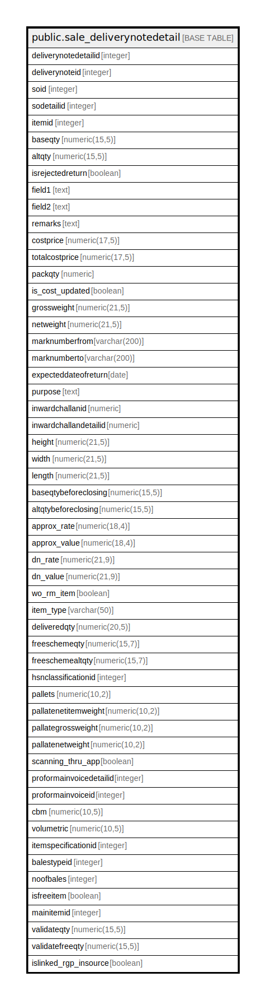

# public.sale_deliverynotedetail

## Description

## Columns

| Name | Type | Default | Nullable | Children | Parents | Comment |
| ---- | ---- | ------- | -------- | -------- | ------- | ------- |
| deliverynotedetailid | integer | nextval('sale_deliverynotedetail_deliverynotedetailid_seq'::regclass) | false |  |  |  |
| deliverynoteid | integer |  | true |  |  |  |
| soid | integer |  | true |  |  |  |
| sodetailid | integer |  | true |  |  |  |
| itemid | integer |  | true |  |  |  |
| baseqty | numeric(15,5) |  | true |  |  |  |
| altqty | numeric(15,5) |  | true |  |  |  |
| isrejectedreturn | boolean | false | true |  |  |  |
| field1 | text |  | true |  |  |  |
| field2 | text |  | true |  |  |  |
| remarks | text |  | true |  |  |  |
| costprice | numeric(17,5) | 0 | true |  |  |  |
| totalcostprice | numeric(17,5) | 0 | true |  |  |  |
| packqty | numeric | 0 | true |  |  |  |
| is_cost_updated | boolean | true | false |  |  |  |
| grossweight | numeric(21,5) | 0 | true |  |  |  |
| netweight | numeric(21,5) | 0 | true |  |  |  |
| marknumberfrom | varchar(200) |  | true |  |  |  |
| marknumberto | varchar(200) |  | true |  |  |  |
| expecteddateofreturn | date |  | true |  |  |  |
| purpose | text |  | true |  |  |  |
| inwardchallanid | numeric |  | true |  |  |  |
| inwardchallandetailid | numeric |  | true |  |  |  |
| height | numeric(21,5) | 0 | true |  |  |  |
| width | numeric(21,5) | 0 | true |  |  |  |
| length | numeric(21,5) | 0 | true |  |  |  |
| baseqtybeforeclosing | numeric(15,5) | NULL::numeric | true |  |  |  |
| altqtybeforeclosing | numeric(15,5) | NULL::numeric | true |  |  |  |
| approx_rate | numeric(18,4) | 0 | true |  |  | Also used to save MRP for clientid 1041 |
| approx_value | numeric(18,4) | 0 | true |  |  |  |
| dn_rate | numeric(21,9) | 0 | true |  |  |  |
| dn_value | numeric(21,9) | 0 | true |  |  |  |
| wo_rm_item | boolean | false | true |  |  | To Save is it Work Order Sent (Raw Material) Item |
| item_type | varchar(50) |  | true |  |  |  |
| deliveredqty | numeric(20,5) |  | true |  |  |  |
| freeschemeqty | numeric(15,7) |  | true |  |  |  |
| freeschemealtqty | numeric(15,7) |  | true |  |  |  |
| hsnclassificationid | integer |  | true |  |  |  |
| pallets | numeric(10,2) |  | true |  |  |  |
| pallatenetitemweight | numeric(10,2) |  | true |  |  |  |
| pallategrossweight | numeric(10,2) |  | true |  |  |  |
| pallatenetweight | numeric(10,2) |  | true |  |  |  |
| scanning_thru_app | boolean | false | true |  |  |  |
| proformainvoicedetailid | integer | 0 | true |  |  |  |
| proformainvoiceid | integer | 0 | true |  |  |  |
| cbm | numeric(10,5) |  | true |  |  |  |
| volumetric | numeric(10,5) |  | true |  |  |  |
| itemspecificationid | integer |  | true |  |  |  |
| balestypeid | integer |  | true |  |  |  |
| noofbales | integer |  | true |  |  |  |
| isfreeitem | boolean | false | true |  |  |  |
| mainitemid | integer |  | true |  |  |  |
| validateqty | numeric(15,5) |  | true |  |  |  |
| validatefreeqty | numeric(15,5) |  | true |  |  |  |
| islinked_rgp_insource | boolean | false | true |  |  |  |

## Constraints

| Name | Type | Definition |
| ---- | ---- | ---------- |
| sale_deliverynotedetail_pkey | PRIMARY KEY | PRIMARY KEY (deliverynotedetailid) |

## Indexes

| Name | Definition |
| ---- | ---------- |
| sale_deliverynotedetail_pkey | CREATE UNIQUE INDEX sale_deliverynotedetail_pkey ON public.sale_deliverynotedetail USING btree (deliverynotedetailid) |
| Index_DN_Det_DNID | CREATE INDEX "Index_DN_Det_DNID" ON public.sale_deliverynotedetail USING btree (deliverynoteid) |
| in_saldndet | CREATE INDEX in_saldndet ON public.sale_deliverynotedetail USING btree (deliverynoteid, deliverynotedetailid, itemid, baseqty, altqty) |

## Triggers

| Name | Definition |
| ---- | ---------- |
| deliverynotedetail_trg_checkstock | CREATE TRIGGER deliverynotedetail_trg_checkstock BEFORE INSERT OR UPDATE ON public.sale_deliverynotedetail FOR EACH ROW EXECUTE FUNCTION trg_checkstock() |

## Relations

---

> Generated by [tbls](https://github.com/k1LoW/tbls)
