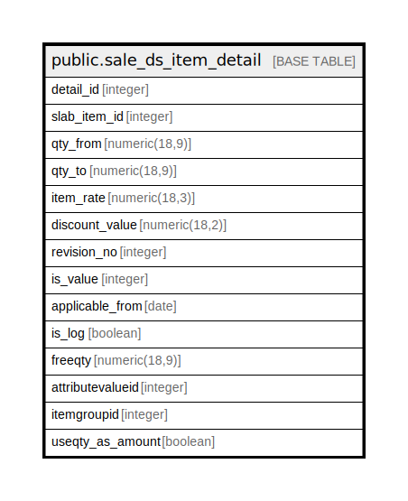

# public.sale_ds_item_detail

## Description

## Columns

| Name | Type | Default | Nullable | Children | Parents | Comment |
| ---- | ---- | ------- | -------- | -------- | ------- | ------- |
| detail_id | integer | nextval('sale_ds_item_detail_detail_id_seq'::regclass) | false |  |  |  |
| slab_item_id | integer |  | true |  |  |  |
| qty_from | numeric(18,9) |  | true |  |  |  |
| qty_to | numeric(18,9) |  | true |  |  |  |
| item_rate | numeric(18,3) |  | true |  |  |  |
| discount_value | numeric(18,2) |  | true |  |  |  |
| revision_no | integer |  | true |  |  |  |
| is_value | integer |  | true |  |  | 1=Percentage,2=Amount,3=Dis. Per Unit |
| applicable_from | date |  | true |  |  |  |
| is_log | boolean |  | true |  |  |  |
| freeqty | numeric(18,9) | 0 | true |  |  |  |
| attributevalueid | integer | 0 | false |  |  |  |
| itemgroupid | integer | 0 | false |  |  |  |
| useqty_as_amount | boolean | false | true |  |  |  |

## Constraints

| Name | Type | Definition |
| ---- | ---- | ---------- |
| sale_ds_item_detail_pkey | PRIMARY KEY | PRIMARY KEY (detail_id) |

## Indexes

| Name | Definition |
| ---- | ---------- |
| sale_ds_item_detail_pkey | CREATE UNIQUE INDEX sale_ds_item_detail_pkey ON public.sale_ds_item_detail USING btree (detail_id) |

## Relations

---

> Generated by [tbls](https://github.com/k1LoW/tbls)
