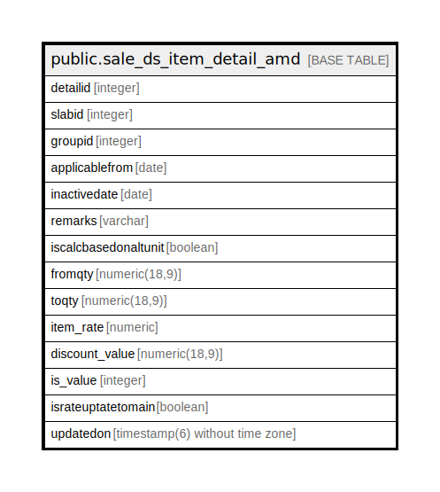

# public.sale_ds_item_detail_amd

## Description

## Columns

| Name | Type | Default | Nullable | Children | Parents | Comment |
| ---- | ---- | ------- | -------- | -------- | ------- | ------- |
| detailid | integer | nextval('sale_ds_item_detail_amd_detailid_seq'::regclass) | false |  |  |  |
| slabid | integer |  | true |  |  |  |
| groupid | integer |  | true |  |  |  |
| applicablefrom | date |  | true |  |  |  |
| inactivedate | date |  | true |  |  |  |
| remarks | varchar |  | true |  |  |  |
| iscalcbasedonaltunit | boolean | false | true |  |  |  |
| fromqty | numeric(18,9) |  | true |  |  |  |
| toqty | numeric(18,9) |  | true |  |  |  |
| item_rate | numeric |  | true |  |  |  |
| discount_value | numeric(18,9) |  | true |  |  |  |
| is_value | integer |  | true |  |  |  |
| israteuptatetomain | boolean | false | true |  |  |  |
| updatedon | timestamp(6) without time zone |  | true |  |  |  |

## Constraints

| Name | Type | Definition |
| ---- | ---- | ---------- |
| sale_ds_item_detail_amd_pkey | PRIMARY KEY | PRIMARY KEY (detailid) |

## Indexes

| Name | Definition |
| ---- | ---------- |
| sale_ds_item_detail_amd_pkey | CREATE UNIQUE INDEX sale_ds_item_detail_amd_pkey ON public.sale_ds_item_detail_amd USING btree (detailid) |

## Relations

---

> Generated by [tbls](https://github.com/k1LoW/tbls)
