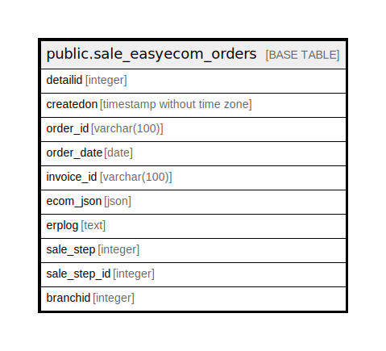

# public.sale_easyecom_orders

## Description

## Columns

| Name | Type | Default | Nullable | Children | Parents | Comment |
| ---- | ---- | ------- | -------- | -------- | ------- | ------- |
| detailid | integer | nextval('sale_easyecom_orders_detailid_seq'::regclass) | false |  |  |  |
| createdon | timestamp without time zone | now() | true |  |  |  |
| order_id | varchar(100) |  | true |  |  |  |
| order_date | date |  | true |  |  |  |
| invoice_id | varchar(100) |  | true |  |  |  |
| ecom_json | json |  | true |  |  |  |
| erplog | text |  | true |  |  |  |
| sale_step | integer | 0 | true |  |  |  |
| sale_step_id | integer | 0 | true |  |  |  |
| branchid | integer | 0 | true |  |  |  |

## Constraints

| Name | Type | Definition |
| ---- | ---- | ---------- |
| sale_easyecom_orders_pkey | PRIMARY KEY | PRIMARY KEY (detailid) |

## Indexes

| Name | Definition |
| ---- | ---------- |
| sale_easyecom_orders_pkey | CREATE UNIQUE INDEX sale_easyecom_orders_pkey ON public.sale_easyecom_orders USING btree (detailid) |

## Relations

---

> Generated by [tbls](https://github.com/k1LoW/tbls)
