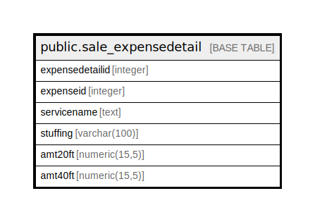

# public.sale_expensedetail

## Description

## Columns

| Name | Type | Default | Nullable | Children | Parents | Comment |
| ---- | ---- | ------- | -------- | -------- | ------- | ------- |
| expensedetailid | integer | nextval('sale_expensedetail_expensedetailid_seq'::regclass) | false |  |  |  |
| expenseid | integer |  | false |  |  |  |
| servicename | text |  | true |  |  |  |
| stuffing | varchar(100) |  | true |  |  |  |
| amt20ft | numeric(15,5) |  | true |  |  |  |
| amt40ft | numeric(15,5) |  | true |  |  |  |

## Constraints

| Name | Type | Definition |
| ---- | ---- | ---------- |
| sale_expensedetail_pkey | PRIMARY KEY | PRIMARY KEY (expensedetailid) |

## Indexes

| Name | Definition |
| ---- | ---------- |
| sale_expensedetail_pkey | CREATE UNIQUE INDEX sale_expensedetail_pkey ON public.sale_expensedetail USING btree (expensedetailid) |

## Relations

---

> Generated by [tbls](https://github.com/k1LoW/tbls)
